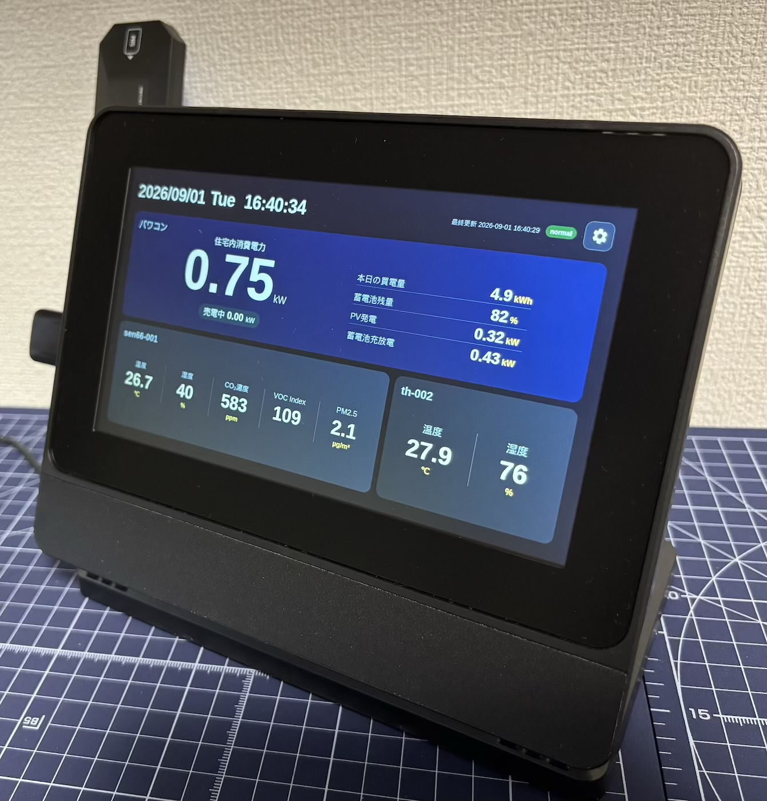

# OMK — おうちモニタキット

おうちモニタキット（OMK）は、一般財団法人電力中央研究所が開発した、住宅内の電力・環境・行動を計測するオープンなIoT基盤です。計測したい項目に合わせてセンサを組み合わせ、Raspberry Piをデータ収集・保存の中心となるGatewayとして使います。標準構成では、構築後は住宅側ネットワークに依存せず運用できます。

## できること

- 対応するセンサ・機器から、住宅の温度、湿度、空気質、電力、在不在などのデータを計測・収集できます。
- Raspberry Piに計測データを保存し、長期間の履歴として蓄積できます。
- Gateway内のローカルDashboardで、現在の計測値と機器の状態を確認できます。
- 保存済みデータをCSV/ZIPとしてUSBメモリへ書き出せます。
- SORACOM Harvestを利用する場合は、計測データをクラウドへ送信して保管できます。

## OMKの製作方法

初めて製作する方は、以下を上から順に読み、各ページ末尾の「次へ」で進めてください。GatewayとSEN66 Nodeを製作し、4-1のDashboardで計測確認まで完了します。

### 1. OMKの概要

- [1-1. OMK導入ガイド](docs/user/getting-started.md)
- [1-2. 対応センサ・機器と取得データ](docs/user/supported-devices.md)

### 2. OMK Gatewayを製作・セットアップする

- [2-1. OMKのパーツ構成](docs/user/parts-list.md)
- [2-2. Gatewayの組み立て](docs/user/gateway-assembly.md)
- [2-3. Gatewayセットアップ](docs/user/gateway-setup.md)

### 3. SEN66 Nodeを製作・セットアップする

- [3-1. SEN66 Nodeの組み立て](docs/user/sen66-node-assembly.md)
- [3-2. SEN66 Nodeをセットアップする](docs/user/esp32-node-setup.md)

### 4. Dashboardを使う

- [4-1. Dashboardの使い方](docs/user/dashboard.md)

ここまでで、推奨構成のOMKの製作・セットアップとSEN66による計測確認は完了です。

## 必要に応じて行う作業

製作完了後に、目的に合うページを選んでください。

- [BLEセンサを追加する](docs/user/ble-sensor-setup.md)
- [Bルートでスマートメーターを追加する](docs/user/broute-setup.md)
- [OMK Nodeで計測範囲を拡張する](docs/user/node-and-sensors.md)
- [中継専用OMK Nodeをセットアップする](docs/user/relay-node-setup.md)
- [Gatewayソフトウェアを更新・保守する](docs/user/gateway-maintenance.md)
- [OMK Nodeを更新・再設定する](docs/user/node-maintenance.md)
- [標準構成以外・高度な構成](docs/user/advanced-configuration.md)

## 参考情報

- [用語集](docs/user/glossary.md)
- [トラブルシューティング](docs/user/troubleshooting.md)

## 対応機器と取得データ

主な対応機器と取得データは次のとおりです。計測項目、接続方式、対応範囲の詳細は[「1-2. 対応センサ・機器と取得データ」](docs/user/supported-devices.md)を参照してください。

| 機器・センサ | 主な取得データ |
| --- | --- |
| 低圧スマートメーター（Bルート） | 系統の瞬時電力、買電・売電の積算電力量、30分ごとの買電量・売電量 |
| Sensirion SEN66 | 温度、相対湿度、CO₂濃度、粒子状物質、VOC Index、NOx Index |
| SwitchBot BLEセンサ | 温湿度、CO₂濃度、人感、開閉、プラグの消費電力・スイッチ状態、防水温湿度 |

## 動作確認環境と利用上の前提

OMKで動作確認している推奨構成は次のとおりです。

- Gateway：**Raspberry Pi 4、Raspberry Pi Touch Display 2（7インチ）、SORACOM Onyx**。OSは64ビットのRaspberry Pi OSを使用します。
- SEN66 Node：Sensirion SEN66とAtomS3 Lite。

初期セットアップには、既存Wi-Fiなどのインターネット接続を使います。APはAccess Point（アクセスポイント）の略です。OMK APを有効にすると、Raspberry Piの内蔵Wi-FiはOMK AP専用となり、外部Wi-Fiには接続できません。推奨構成ではSORACOM Onyxを外部通信と遠隔管理に使います。

標準構成以外の対応範囲と制約は、[「標準構成以外・高度な構成」](docs/user/advanced-configuration.md)を参照してください。

## OMKを開発する

- [アーキテクチャ](docs/developer/architecture.md)
- [開発ガイド](docs/developer/development.md)
- [Gatewayネットワーク設計](docs/developer/networking.md)
- [データ経路とMQTT仕様](docs/developer/data-and-mqtt.md)
- [リポジトリ構成](docs/developer/repository-structure.md)
- [設計判断の記録](docs/decisions/)

各サービスとファームウェアのREADMEには、個別の起動・設定・テスト・デバッグ方法を記載しています。

## 利用上の注意

OMKは研究・実験用途のシステムであり、商用製品やサービスではありません。計測値の正確性、完全性、継続性、対応機器との互換性、安定動作および安全性は保証しません。利用、改変、機器への接続、再配布は各利用者の判断と責任で行ってください。料金精算、契約上の計量、安全制御、保護制御など、高い信頼性を要する用途での利用は想定していません。

無保証および責任制限は[LICENSE](LICENSE)を参照してください。

## 成果発表

OMKを使用した技術開発等の成果を発表・報告する際は、可能な範囲でOMKを使用した旨の表示をお願いします。

## サポートと開発方針

GitHub等から利用する場合、機器の準備、構築、設定、運用、保守は利用者自身で行います。研究所および開発者は、個別環境への導入・設定支援、機器の製作代行、トラブル対応などの個別サポート、保守、動作保証を提供しません。

活用例、アイデア、改善案など、OMK全体に有用な情報の共有は歓迎します。ただし、相談や要望に対する回答、調査、機能追加、機器対応、修正などの対応は約束しません。

特定の利用者だけに必要な機能は、利用者自身のforkで開発・維持することを想定します。OMK全体に有用なアイデアは、研究目的、汎用性、保守性、開発優先度などを踏まえて採用を検討します。提案者にPR作成を求めるとは限らず、OMK開発側が実装する場合や、実装を見送る場合もあります。

GitHubでの情報共有・提案は、次の方針で受け付けます。

- GitHub Discussions：アイデア、活用例、利用方法の情報共有に使います。無償の個別サポート窓口ではありません。
- Issue：再現可能な不具合や、対応が決まった課題の管理に使います。単なる機能追加要望はDiscussionへ投稿してください。
- コード変更・機能追加の提案：まずDiscussionで目的、背景、想定用途、OMK全体への有用性を共有してください。OMKリポジトリへの取り込みを検討する場合は、必要に応じてIssue化やPR提出を案内します。PRの常時募集は行わず、事前相談のないPRへのレビュー、マージ、対応は約束しません。

電力中央研究所が主体となる研究・実証・被験者実験で設置する場合は、研究計画に基づき、研究実施側が設置、運用、保守、トラブル対応等を行います。上記の自己責任・サポート方針によって、実験協力者へ保守責任を転嫁することはありません。

## ライセンス

OMKのソフトウェアは[使用、複製および頒布に関する条件](LICENSE)で公開します。OMKの著作権は一般財団法人電力中央研究所に帰属します。

利用、改変、再配布、商用利用については、使用許諾条件に従ってください。
