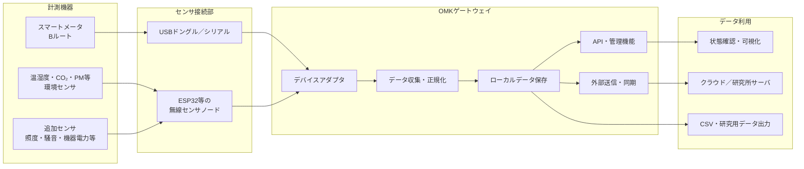
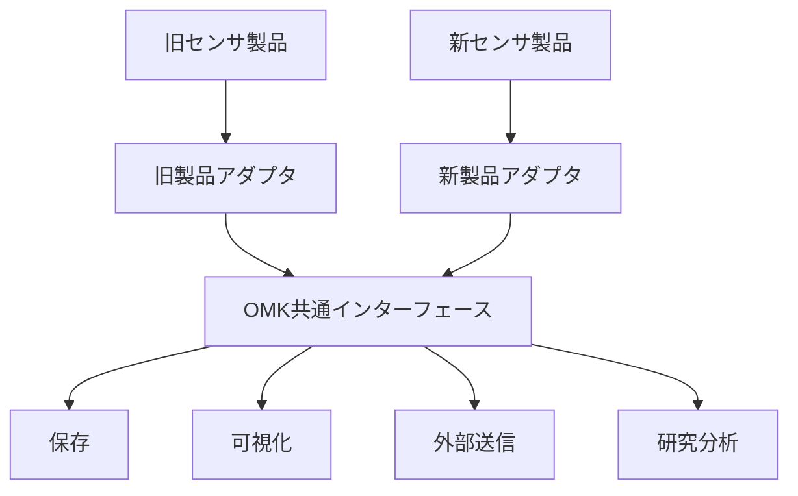
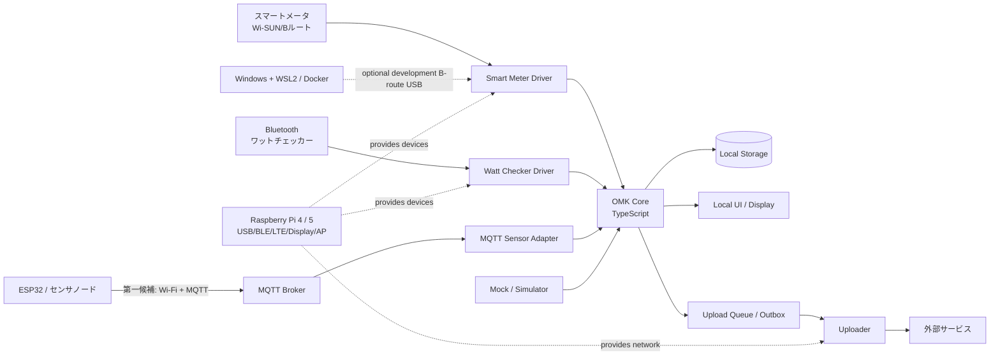

<<<<<<< HEAD
# おうちモニタキット（OMK）再開発

## 計画・方針・システム設計の概要

## 1. 背景

おうちモニタキット（OMK）は、住宅内の電力消費量、温湿度、空気質などを簡易に計測し、住宅・エネルギー分野の研究に活用するための計測システムである。

現行システムは開発から約10年が経過しており、以下の問題が顕在化している。

* 委託開発されたソフトウェアの内部構造や仕様が分かりにくい
* OS、Node.js、Python、ライブラリ等の更新に追従できていない
* センサ、通信機器、ゲートウェイ端末の廃盤が発生している
* 特定製品や特定ベンダーへの依存が強い
* 機能追加や不具合修正に多くの調査・作業を要する
* 研究目的ごとにセンサや処理を変更しにくい

今回の再開発では、現行機能を単純に再現するのではなく、今後の製品変更、研究ニーズの変化、ソフトウェア更新を前提とした構造へ再設計する。

---

## 2. 再開発の目的

OMK再開発の主な目的は、次のとおりである。

1. **住宅への設置・運用を容易にする**
2. **センサや通信機器の変更を吸収できるようにする**
3. **研究目的に応じて計測項目を追加できるようにする**
4. **ソフトウェアを継続的に更新できるようにする**
5. **特定の担当者やベンダーに依存しない開発体制を構築する**
6. **生成AIを利用した開発・保守を行いやすくする**

---

## 3. 基本方針

### 3.1 製品ではなく「役割」に依存する

特定のセンサやゲートウェイ製品をシステムの前提とせず、各機器が担う役割を明確にする。

例えば、温湿度・CO₂・粒子状物質を計測するセンサが廃盤になった場合でも、同じ種類のデータを出力できる別製品へ交換できる構造とする。

システム内部では、製品固有の通信方式やデータ形式を直接扱わず、共通形式へ変換してから利用する。

---

### 3.2 住宅側のWi-Fiに依存しない

OMKはさまざまな住宅への設置を想定しているため、原則として設置先住宅のWi-Fiは利用しない。

住宅側Wi-Fiを利用すると、以下の問題が生じる。

* 居住者によるSSID・パスワード登録が必要になる
* ルータ交換時に再設定が必要になる
* IPアドレスやネットワーク構成が住宅ごとに異なる
* セキュリティポリシーや通信制限の影響を受ける
* 現地対応の負担が大きくなる

このため、ゲートウェイ端末をWi-Fiアクセスポイントとして動作させ、センサノードはOMK自身のネットワークへ接続する構成を基本とする。

外部へのデータ送信が必要な場合は、携帯通信回線など、住宅ネットワークとは独立した通信手段を検討する。

---

### 3.3 機能を小さな単位へ分離する

計測、通信、保存、送信、表示などの機能を分離し、ある機能の変更がシステム全体へ波及しない構造とする。

ただし、初期段階から多数のマイクロサービスへ細分化するのではなく、まずは一つのシステムとして管理しながら内部を明確なモジュールに分割する「モジュラーモノリス」を基本とする。

必要性が明確になった機能については、後から独立したコンテナやサービスへ分離できる構造とする。

---

### 3.4 Dockerを実行環境の基本とする

ソフトウェアはDockerコンテナ上で動作させ、OSやライブラリの違いによる影響を小さくする。

Dockerの採用によって、すべての保守問題が解消されるわけではない。センサドライバやライブラリの更新は引き続き必要である。

一方で、以下の効果が期待できる。

* 開発環境と実機環境の差を小さくできる
* 使用するライブラリのバージョンを明確にできる
* 古い環境を再現しやすい
* 更新対象と影響範囲を限定できる
* 問題発生時に以前のイメージへ戻しやすい
* WindowsとRaspberry Piで共通の開発手順を利用できる

---

## 4. 想定する全体構成



---

## 5. ソフトウェア設計

### 5.1 デバイスアダプタ

センサや通信機器ごとの差異は、デバイスアダプタで吸収する。

アダプタは、製品固有の通信処理を行い、取得した値をOMK共通のデータ形式へ変換する。

例：

```text
SEN66固有データ
    ↓
SEN66アダプタ
    ↓
OMK共通形式
温度、湿度、CO₂、PM2.5、VOC、取得時刻、機器ID
```

センサを交換する場合は、新しいアダプタを追加または交換し、データ収集以降の処理は原則として変更しない。

---

### 5.2 共通データ形式

各センサのデータは、最低限以下の情報を持つ共通形式へ変換する。

* 計測対象
* 計測値
* 単位
* 取得時刻
* センサID
* 設置場所
* 品質・エラー情報
* 使用したアダプタのバージョン

概念例：

```json
{
  "timestamp": "2026-07-23T12:00:00+09:00",
  "device_id": "living-sen66-01",
  "location": "living_room",
  "metric": "co2",
  "value": 650,
  "unit": "ppm",
  "quality": "normal",
  "adapter_version": "1.0.0"
}
```

共通形式を定めることで、センサ製品が変わっても、保存、可視化、外部送信、分析処理を共通化できる。

---

### 5.3 モジュール構成

初期段階では、以下のようなモジュール分割を想定する。

```text
omk/
├── adapters/        # センサ・通信機器固有の処理
├── collector/       # データ収集とスケジューリング
├── domain/          # 共通データモデルと主要ロジック
├── storage/         # データベース・ファイル保存
├── api/             # 管理・参照用API
├── exporter/        # CSV出力・外部送信
├── config/          # 設定定義
├── tests/           # 自動テスト
└── docs/            # 設計・運用・意思決定記録
```

モジュール間の呼び出し方向を明確にし、センサ固有処理がシステム全体へ広がらないようにする。

---

### 5.4 コンテナ構成

初期構成では、以下の単位でコンテナを分けることを候補とする。

* データ収集・APIコンテナ
* データベースコンテナ
* 可視化コンテナ
* 外部送信コンテナ

ただし、運用負担が増える場合は、データ収集、API、外部送信を一つのコンテナにまとめてもよい。

コンテナ数を増やすこと自体を目的とせず、更新周期、障害範囲、権限、依存ライブラリが異なる機能を分離する。

---

## 6. 生成AIを利用しやすい設計

今後は、人間だけでなく生成AIによるコード理解、修正、テスト作成、ライブラリ更新への対応を想定する。

そのため、以下を設計上の原則とする。

* 一つのファイルや関数を過度に長くしない
* モジュールの責務を一つに絞る
* 入出力とインターフェースを明示する
* 暗黙的な状態や複雑な副作用を避ける
* 設定値をソースコードへ直接記述しない
* 各モジュールに自動テストを用意する
* READMEと設計文書を常に更新する
* 重要な設計判断をADRとして記録する
* サンプルデータと機器を使わないテスト手段を用意する
* エラーメッセージとログを機械的に追跡できる形式にする

生成AIが扱いやすい構造は、人間にとっても理解・保守しやすい構造となる。

---

## 7. 開発環境

### 基本環境

* 開発PC：Windows 11
* Linux環境：WSL2
* エディタ：Visual Studio Code
* 実行環境：Docker／Docker Compose
* バージョン管理：Git
* リモートリポジトリ：GitHub
* 実機候補：Raspberry Pi 4またはRaspberry Pi 5

---

### Windows上での初期開発

初期開発は、Raspberry Pi上だけで行うのではなく、Windows上のWSL2およびDocker環境を中心に進める。

Windows上で以下を先行して開発・確認する。

* 共通データモデル
* Bルート通信処理
* センサアダプタ
* データ保存
* API
* CSV出力
* ログ・エラー処理
* 自動テスト
* Docker構成

Bルート通信については、対応ドングルをWindows PCへ接続し、WSL2またはDockerコンテナから利用する方法を検証する。

GPIO、I²C、Bluetooth、アクセスポイント機能など、Raspberry Pi固有の機能は、後の実機検証で確認する。

---

### CPUアーキテクチャへの対応

開発PCは主にAMD64、Raspberry PiはARM64で動作する。

Dockerイメージについては、可能な限りAMD64とARM64の両方で動作するマルチアーキテクチャ構成とする。

ハードウェアへ直接アクセスする処理はアダプタ層へ限定し、その他の処理は両環境で共通化する。

---

## 8. 想定するハードウェア構成

現時点では、以下を候補として検討している。

| 区分     | 候補               | 役割                 |
| ------ | ---------------- | ------------------ |
| ゲートウェイ | Raspberry Pi 4／5 | データ収集、保存、通信、AP機能   |
| 環境センサ  | SEN66等           | 温湿度、CO₂、粒子状物質、VOC等 |
| センサノード | ESP32            | センサ接続、BLE／Wi-Fi通信  |
| 電力計測   | Bルート対応USBドングル    | スマートメータからの電力データ取得  |
| 外部通信   | LTE／USBモデム等      | 住宅Wi-Fiを使わない外部送信   |
| ストレージ  | microSDまたは外部SSD  | ローカルデータ保存          |
| 電源・筐体  | 市販品または専用構成       | 長期安定運用             |

SEN66を直接Raspberry Piへ接続する構成だけでなく、ESP32をセンサノードとして利用し、ゲートウェイとセンサを離して設置できる構成も検討する。

---

## 9. 製品廃止を吸収する仕組み

製品廃止への対応は、代替品をその都度探すだけではなく、システム構造として吸収する。



主な対策は以下のとおりである。

* 製品固有処理をアダプタへ隔離する
* 共通データ形式を定義する
* センサの識別情報と校正情報を管理する
* 実機がなくても動作確認できるモックを用意する
* 過去データを使った回帰テストを実施する
* 複数製品を同時にサポートできる構造とする
* 製品選定条件と代替候補を文書化する
* ソフトウェアと設定ファイルのバージョンを記録する

---

## 10. 開発の進め方

### フェーズ1：要件・基本設計

* 現行OMKの機能整理
* 今後必要な計測項目の整理
* 必須機能と研究ごとの追加機能の分離
* 共通データ形式の策定
* モジュール構成の決定
* 通信・ネットワーク方式の検討

### フェーズ2：Windows上での基盤開発

* GitHubリポジトリの整備
* Docker開発環境の構築
* 共通データモデルの実装
* Bルート通信の試作
* センサアダプタの試作
* データ保存、API、ログ機能の実装
* 自動テスト環境の構築

### フェーズ3：Raspberry Pi実機対応

* ARM64環境での動作確認
* USB、I²C、Bluetooth等の接続確認
* Wi-Fiアクセスポイント機能の構築
* 自動起動・異常復旧機能の実装
* 電源断や通信断を想定した試験
* 長期間連続運転試験

### フェーズ4：試験設置

* 所内または協力住宅での試験
* 設置作業手順の確認
* 欠測、通信断、センサ異常の評価
* ログと遠隔状態確認方法の評価
* データ品質の確認

### フェーズ5：運用・更新体制の整備

* 更新手順の標準化
* バージョン管理ルールの策定
* 対応機器一覧の管理
* 障害時の切り戻し手順の整備
* 設計文書と運用マニュアルの継続更新

---

## 11. 当面の検討事項

現時点で、特に以下を整理する必要がある。

1. ゲートウェイ端末をRaspberry Pi 4と5のどちらにするか
2. 環境センサをゲートウェイへ直接接続するか、ESP32経由とするか
3. ESP32とゲートウェイ間をBLEとWi-Fiのどちらで接続するか
4. Wi-Fiアクセスポイント機能と外部通信をどのように共存させるか
5. ローカルに保存するデータ量と保存期間
6. クラウドまたは研究所サーバへの送信方式
7. 遠隔更新と障害復旧の方法
8. 対応するセンサの必須範囲
9. セキュリティ、認証、暗号化の方針
10. 長期運用に適したストレージと電源構成
11. 既存OMKとのデータ互換性
12. 研究利用向けAPIおよびデータ出力仕様

---

## 12. まとめ

OMK再開発では、特定製品の置き換えではなく、製品変更やソフトウェア更新を前提とした持続可能な計測基盤を構築する。

中心となる考え方は、以下のとおりである。

* 製品固有処理をアダプタへ隔離する
* センサデータを共通形式へ変換する
* システムを責務ごとのモジュールへ分割する
* Dockerによって開発・実行環境を標準化する
* Windows上で基盤を開発し、Raspberry Piへ展開する
* 住宅側Wi-Fiへ依存しない
* テスト、文書、ログを含めて保守可能な状態を維持する
* 人間と生成AIの双方が理解しやすい構造とする

これにより、センサやゲートウェイ製品が変更された場合でも、影響範囲を限定しながらOMKを継続的に更新できる構造を目指す。

---

# OMK — おうちモニタキット

OMK（おうちモニタキット）は、住宅内の電力消費と環境・行動に関係するデータを、必要なセンサを組み合わせて継続的に計測・可視化・送信するためのIoTセンサ基盤です。

このリポジトリでは、既存のOMKを単にコンテナ化するだけでなく、次の状態へ再設計することを目的とします。

- Raspberry Pi 4およびRaspberry Pi 5の両方で安定して長期間運用できる
- 正式対象OSを64-bit Raspberry Pi OSへ限定し、32-bit版を対象外とする
- Windows上でモックを使って開発・テストでき、開発中に必要な場合だけBルートUSBドングルを使ってスマートメータ実機を検証できる
- センサ、通信機器、クラウド送信先を交換しやすい
- 既存のNode.js処理とPython処理を段階的に整理できる
- 人間と生成AIのどちらにも構造と判断理由が分かる
- 一部の機器や製品が廃止されても、システム全体を書き直さずに済む

> **現在の位置付け**  
> 本文書は再開発時の設計基準です。既存実装と本文書が食い違う場合は、既存実装を無条件に正とせず、差分を確認して設計判断を記録してください。

## 1. OMKが扱う範囲

OMKは、次の処理を一つの製品・開発基盤として扱います。

1. センサや計測機器からデータを取得する
2. ベンダー固有の形式をOMK共通データ形式へ変換する
3. データを一時保存し、欠損や通信断に耐える
4. 本体ディスプレイやWeb UIで現在値・履歴を表示する
5. SORACOM等の通信回線を通じて外部へ送信する
6. 機器状態、通信状態、異常を監視できるようにする

既存または移行対象として、少なくとも次を想定します。

- スマートメータBルート通信
- Bluetooth対応ワットチェッカー
- 室温・湿度・CO2濃度・ドア開閉等のセンサ
- Raspberry Pi公式7インチディスプレイ
- SORACOM Onyx等のLTE USBドングル
- ESP32を利用した遠隔センサノード

## 2. 採用する設計方針

### 2.1 モジュラーモノリスを基本とする

業務ロジックは一つのコードベース内で明確なモジュールに分けます。最初から多数のマイクロサービスへ分割しません。

一方、次のように実行環境や責務が明確に異なるものは、Docker Compose上で別コンテナにできます。

- TypeScriptによるOMKコア
- Web UI
- MQTTブローカー（ESP32連携の第一候補であるWi-Fi＋MQTT方式に使用）
- 移行期間中のPythonアップローダ
- 開発用センサシミュレータ

つまり、**コード構造はモジュラーモノリス、配備は少数の責務別コンテナ**を基本とします。

### 2.2 ハードウェア固有処理を隔離する

スマートメータ、Bluetooth機器、USBシリアル、ESP32等へのアクセスは、ドメインロジックから直接行いません。各機器は共通インターフェースを実装する「ドライバ／アダプタ」として扱います。

機器固有コードを交換しても、計測、保存、表示、送信のロジックが影響を受けない構造にします。

### 2.3 Raspberry Pi OSとDockerの責務を分ける

次は原則としてホストOS側の責務です。

- LTEドングルの認識・接続設定
- BluetoothデーモンとD-Bus
- USB・シリアルデバイスの認識と権限
- udevによる安定したデバイス名
- ディスプレイの向き、解像度、キオスク起動
- 時刻同期、OS更新、再起動、電源管理

次は原則としてコンテナ側の責務です。

- 計測プロトコルの実装
- データ正規化
- 保存、可視化、送信
- 再送、エラー処理、ログ、ヘルスチェック
- モック／シミュレータによる開発

コンテナへ安易に`privileged: true`を与えず、必要なデバイス、ソケット、権限だけを明示します。

### 2.4 Windowsではモックを基本とし、Bルート実機接続は任意とする

Windowsは主に開発・デバッグ・自動テスト用です。通常の開発とCIでは、USB、Bluetooth、Wi-SUN、LTE等を、同じインターフェースを実装するモックまたはシミュレータへ差し替えます。実機がなくても全体を起動できることを開発要件とします。

Bルート対応USBドングルをWindowsへ接続し、WSL2またはDockerコンテナから利用する経路は、利用できる開発者向けの任意検証経路とします。目的は、開発中にスマートメータ実機との接続、認証、計測、切断、再接続を確認することに限定します。通常の開発、CI、本番運用の必須要件には含めません。正式な対応判定と長時間試験は、Raspberry Pi 4とRaspberry Pi 5の両方で行います。Windows固有の差異はアダプタ、デバイスパス、Compose差分へ隔離します。

### 2.5 MQTTは機器境界の第一候補とする

ESP32等の外部ノード、疎結合にする必要がある計測プロセス、状態通知では、OMK用Wi-Fi＋MQTTを第一候補として設計・試作します。BLEは代替候補として比較しますが、初期実装はWi-Fi＋MQTTを優先します。

同一プロセス内のモジュール間通信まで何でもMQTTにせず、プロセス内では型付きの関数・ポートを優先します。

## 3. 全体像



## 4. 想定リポジトリ構成

```text
.
├── README.md
├── AGENTS.md                  # Codex等に与える作業規約。別途作成する
├── compose.yaml
├── compose.pi.yaml           # Raspberry Pi 4／5の実機向け差分
├── compose.mock.yaml         # Windows・実機なし開発向け差分
├── compose.windows-hardware.yaml # Windows上の任意Bルート実機検証向け差分
├── .env.example
├── apps/
│   ├── core/                  # TypeScriptのモジュラーモノリス
│   │   └── src/
│   │       ├── modules/
│   │       │   ├── devices/
│   │       │   ├── measurements/
│   │       │   ├── storage/
│   │       │   ├── upload/
│   │       │   └── health/
│   │       ├── ports/         # 外部依存に対するインターフェース
│   │       ├── adapters/      # Wi-SUN、BLE、MQTT、DB等
│   │       └── bootstrap/     # DI、設定読込、起動処理
│   ├── ui/                    # 本体表示・Web UI
│   └── uploader-python/       # 既存Python処理の移行用
├── packages/
│   ├── contracts/             # MQTT/API/イベントの共有スキーマ
│   └── testkit/               # モック、fixture、契約テスト支援
├── firmware/
│   └── esp32/                 # ESP32センサノード
├── config/
│   ├── example/
│   └── schemas/
├── scripts/                   # セットアップ、診断、保守
├── tests/
│   ├── integration/
│   └── hardware/
└── docs/
    ├── project-overview.md
    ├── architecture.md
    ├── design-principles.md
    ├── hardware.md
    ├── development.md
    └── roadmap.md
```

この構成は実装開始時の基準です。実際の責務が見えた段階で変更できますが、変更時は`docs/architecture.md`も同時に更新します。

## 5. 開発環境

### Windows・モック環境

目的は、ドメインロジック、UI、保存、送信制御、エラー処理をハードウェアなしで開発することです。

```bash
cp .env.example .env
docker compose -f compose.yaml -f compose.mock.yaml up --build
```

モック構成では、センサシミュレータが共通データ形式またはMQTTメッセージを生成します。

### Windows・Bルート実機検証（任意）

Bルート対応USBドングルをWindowsからWSL2へ公開し、実機向けアダプタを有効にします。この経路は、開発中にスマートメータ実機との接続や計測を確認する必要がある開発者だけが使用します。USB転送方法、デバイスパス、権限はWindows／WSL2側の構成へ隔離します。

```bash
cp .env.example .env
docker compose -f compose.yaml -f compose.windows-hardware.yaml up --build
```

この構成でも、Bルート以外の機器はモックへ差し替え可能にします。Windowsでの実機検証は本番対応の判定には使用せず、同じ契約テスト、再接続試験、連続試験をRaspberry Pi 4とRaspberry Pi 5の両方で実施します。

### Raspberry Pi 4／5の実機

Raspberry Pi 4とRaspberry Pi 5の両方を正式対応機とします。正式対象OSは64-bit Raspberry Pi OSのみとし、32-bit Raspberry Pi OSは対象外です。周辺機器を認識・設定した後、実機向けCompose差分を使います。Raspberry Pi 3以前と、未評価の将来モデルは新OMKの正式な実行対象に含めません。

```bash
cp .env.example .env
docker compose -f compose.yaml -f compose.pi.yaml up -d --build
```

実機構成では、必要な`/dev`デバイス、D-Busソケット、設定ファイルだけを対象コンテナへ渡します。

> 上記ファイルがまだ存在しない段階では、これらを「実装すべき標準インターフェース」として扱ってください。

## 6. 設定と秘密情報

次の情報をGitへコミットしてはいけません。

- BルートID・パスワード
- SORACOMや外部サービスの認証情報
- MQTTの本番パスワード・証明書
- 住宅、利用者、設置場所を特定できる情報
- SIMや機器に紐づく秘密値

`.env.example`にはキー名と説明だけを置き、実値は`.env`、Docker secrets、または運用環境の秘密管理へ置きます。

## 7. 文書

- [計画・方針・システム設計の概要](docs/project-overview.md) — 再開発の背景、目的、全体方針、進め方
- [アーキテクチャ](docs/architecture.md) — モジュール境界、通信、データフロー、依存規則
- [設計原則](docs/design-principles.md) — 長期保守、交換可能性、AIフレンドリーな実装規約
- [ハードウェア](docs/hardware.md) — Raspberry Pi、Windows、ESP32、周辺機器の責務分担
- [開発ガイド](docs/development.md) — 開発手順、テスト、センサ追加、Codex利用時の規則
- [ロードマップ](docs/roadmap.md) — 移行手順、完了条件、未決定事項

## 8. 実装時の必須ルール

- ベンダーSDKやデバイスAPIをドメイン層から直接呼ばない
- 計測値は共通の`Measurement`へ正規化してから後段へ渡す
- 時刻は内部ではUTCを使い、表示時だけローカル時刻へ変換する
- 値には単位を必ず持たせる
- 一つのセンサ故障で全計測を停止させない
- 外部送信は再送可能かつ重複に耐える設計にする
- 実機なしで動くモックを各ドライバに用意し、BルートのWindows実機検証は任意経路、正式な実機検証はRaspberry Pi 4と5の両方で行う
- 仕様変更にはテストと文書更新を含める
- 不明な設計事項を推測で固定せず、`docs/roadmap.md`の未決定事項へ追加する

## 9. 文書内のステータス表記

各文書では、設計判断を次のラベルで区別します。

- **採用**: 現時点で実装の基準とする
- **暫定**: 初期実装では使うが、検証後に見直す可能性がある
- **未決定**: 実装前または実装中に判断が必要
- **移行対象**: 既存実装を維持しつつ段階的に置き換える

>>>>>>> 99b2bcf (docs: add OMK redevelopment plan and design documents)
