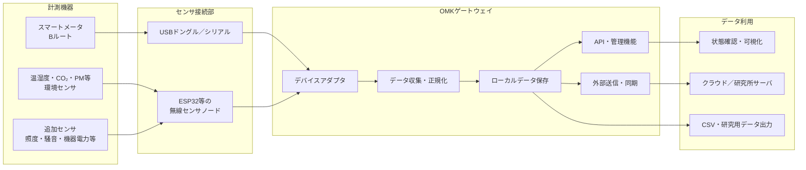
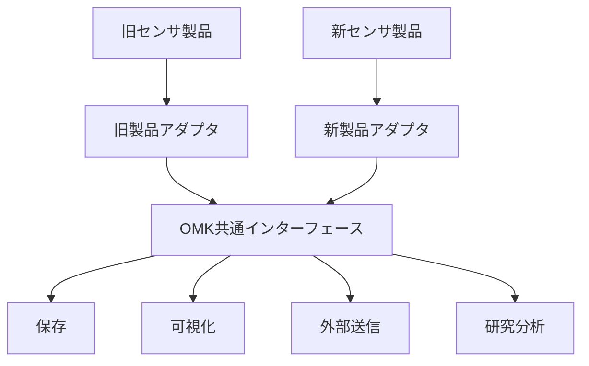

# おうちモニタキット（OMK）再開発

## 計画・方針・システム設計の概要

## 1. 背景

おうちモニタキット（OMK）は、住宅内の電力消費量、温湿度、空気質などを簡易に計測し、住宅・エネルギー分野の研究に活用するための計測システムである。

現行システムは開発から約10年が経過しており、以下の問題が顕在化している。

* 委託開発されたソフトウェアの内部構造や仕様が分かりにくい
* OS、Node.js、Python、ライブラリ等の更新に追従できていない
* センサ、通信機器、ゲートウェイ端末の廃盤が発生している
* 特定製品や特定ベンダーへの依存が強い
* 機能追加や不具合修正に多くの調査・作業を要する
* 研究目的ごとにセンサや処理を変更しにくい

今回の再開発では、現行機能を単純に再現するのではなく、今後の製品変更、研究ニーズの変化、ソフトウェア更新を前提とした構造へ再設計する。

---

## 2. 再開発の目的

OMK再開発の主な目的は、次のとおりである。

1. **住宅への設置・運用を容易にする**
2. **センサや通信機器の変更を吸収できるようにする**
3. **研究目的に応じて計測項目を追加できるようにする**
4. **ソフトウェアを継続的に更新できるようにする**
5. **特定の担当者やベンダーに依存しない開発体制を構築する**
6. **生成AIを利用した開発・保守を行いやすくする**

---

## 3. 基本方針

### 3.1 製品ではなく「役割」に依存する

特定のセンサやゲートウェイ製品をシステムの前提とせず、各機器が担う役割を明確にする。

例えば、温湿度・CO₂・粒子状物質を計測するセンサが廃盤になった場合でも、同じ種類のデータを出力できる別製品へ交換できる構造とする。

システム内部では、製品固有の通信方式やデータ形式を直接扱わず、共通形式へ変換してから利用する。

---

### 3.2 住宅側のWi-Fiに依存しない

OMKはさまざまな住宅への設置を想定しているため、原則として設置先住宅のWi-Fiは利用しない。

住宅側Wi-Fiを利用すると、以下の問題が生じる。

* 居住者によるSSID・パスワード登録が必要になる
* ルータ交換時に再設定が必要になる
* IPアドレスやネットワーク構成が住宅ごとに異なる
* セキュリティポリシーや通信制限の影響を受ける
* 現地対応の負担が大きくなる

このため、ゲートウェイ端末をWi-Fiアクセスポイントとして動作させ、センサノードはOMK自身のネットワークへ接続する構成を基本とする。

外部へのデータ送信が必要な場合は、携帯通信回線など、住宅ネットワークとは独立した通信手段を検討する。

---

### 3.3 機能を小さな単位へ分離する

計測、通信、保存、送信、表示などの機能を分離し、ある機能の変更がシステム全体へ波及しない構造とする。

ただし、初期段階から多数のマイクロサービスへ細分化するのではなく、まずは一つのシステムとして管理しながら内部を明確なモジュールに分割する「モジュラーモノリス」を基本とする。

必要性が明確になった機能については、後から独立したコンテナやサービスへ分離できる構造とする。

---

### 3.4 Dockerを実行環境の基本とする

ソフトウェアはDockerコンテナ上で動作させ、OSやライブラリの違いによる影響を小さくする。

Dockerの採用によって、すべての保守問題が解消されるわけではない。センサドライバやライブラリの更新は引き続き必要である。

一方で、以下の効果が期待できる。

* 開発環境と実機環境の差を小さくできる
* 使用するライブラリのバージョンを明確にできる
* 古い環境を再現しやすい
* 更新対象と影響範囲を限定できる
* 問題発生時に以前のイメージへ戻しやすい
* WindowsとRaspberry Piで共通の開発手順を利用できる

---

## 4. 想定する全体構成



---

## 5. ソフトウェア設計

### 5.1 デバイスアダプタ

センサや通信機器ごとの差異は、デバイスアダプタで吸収する。

アダプタは、製品固有の通信処理を行い、取得した値をOMK共通のデータ形式へ変換する。

例：

```text
SEN66固有データ
    ↓
SEN66アダプタ
    ↓
OMK共通形式
温度、湿度、CO₂、PM2.5、VOC、取得時刻、機器ID
```

センサを交換する場合は、新しいアダプタを追加または交換し、データ収集以降の処理は原則として変更しない。

---

### 5.2 共通データ形式

各センサのデータは、最低限以下の情報を持つ共通形式へ変換する。

* 計測対象
* 計測値
* 単位
* 取得時刻
* センサID
* 設置場所
* 品質・エラー情報
* 使用したアダプタのバージョン

概念例：

```json
{
  "timestamp": "2026-07-23T12:00:00+09:00",
  "device_id": "living-sen66-01",
  "location": "living_room",
  "metric": "co2",
  "value": 650,
  "unit": "ppm",
  "quality": "normal",
  "adapter_version": "1.0.0"
}
```

共通形式を定めることで、センサ製品が変わっても、保存、可視化、外部送信、分析処理を共通化できる。

---

### 5.3 モジュール構成

初期段階では、以下のようなモジュール分割を想定する。

```text
omk/
├── adapters/        # センサ・通信機器固有の処理
├── collector/       # データ収集とスケジューリング
├── domain/          # 共通データモデルと主要ロジック
├── storage/         # データベース・ファイル保存
├── api/             # 管理・参照用API
├── exporter/        # CSV出力・外部送信
├── config/          # 設定定義
├── tests/           # 自動テスト
└── docs/            # 設計・運用・意思決定記録
```

モジュール間の呼び出し方向を明確にし、センサ固有処理がシステム全体へ広がらないようにする。

---

### 5.4 コンテナ構成

初期構成では、以下の単位でコンテナを分けることを候補とする。

* データ収集・APIコンテナ
* データベースコンテナ
* 可視化コンテナ
* 外部送信コンテナ

ただし、運用負担が増える場合は、データ収集、API、外部送信を一つのコンテナにまとめてもよい。

コンテナ数を増やすこと自体を目的とせず、更新周期、障害範囲、権限、依存ライブラリが異なる機能を分離する。

---

## 6. 生成AIを利用しやすい設計

今後は、人間だけでなく生成AIによるコード理解、修正、テスト作成、ライブラリ更新への対応を想定する。

そのため、以下を設計上の原則とする。

* 一つのファイルや関数を過度に長くしない
* モジュールの責務を一つに絞る
* 入出力とインターフェースを明示する
* 暗黙的な状態や複雑な副作用を避ける
* 設定値をソースコードへ直接記述しない
* 各モジュールに自動テストを用意する
* READMEと設計文書を常に更新する
* 重要な設計判断をADRとして記録する
* サンプルデータと機器を使わないテスト手段を用意する
* エラーメッセージとログを機械的に追跡できる形式にする

生成AIが扱いやすい構造は、人間にとっても理解・保守しやすい構造となる。

---

## 7. 開発環境

### 基本環境

* 開発PC：Windows 11
* Linux環境：WSL2
* エディタ：Visual Studio Code
* 実行環境：Docker／Docker Compose
* バージョン管理：Git
* リモートリポジトリ：GitHub
* 実機候補：Raspberry Pi 4またはRaspberry Pi 5

---

### Windows上での初期開発

初期開発は、Raspberry Pi上だけで行うのではなく、Windows上のWSL2およびDocker環境を中心に進める。

Windows上で以下を先行して開発・確認する。

* 共通データモデル
* Bルート通信処理
* センサアダプタ
* データ保存
* API
* CSV出力
* ログ・エラー処理
* 自動テスト
* Docker構成

Bルート通信については、対応ドングルをWindows PCへ接続し、WSL2またはDockerコンテナから利用する方法を検証する。

GPIO、I²C、Bluetooth、アクセスポイント機能など、Raspberry Pi固有の機能は、後の実機検証で確認する。

---

### CPUアーキテクチャへの対応

開発PCは主にAMD64、Raspberry PiはARM64で動作する。

Dockerイメージについては、可能な限りAMD64とARM64の両方で動作するマルチアーキテクチャ構成とする。

ハードウェアへ直接アクセスする処理はアダプタ層へ限定し、その他の処理は両環境で共通化する。

---

## 8. 想定するハードウェア構成

現時点では、以下を候補として検討している。

| 区分     | 候補               | 役割                 |
| ------ | ---------------- | ------------------ |
| ゲートウェイ | Raspberry Pi 4／5 | データ収集、保存、通信、AP機能   |
| 環境センサ  | SEN66等           | 温湿度、CO₂、粒子状物質、VOC等 |
| センサノード | ESP32            | センサ接続、BLE／Wi-Fi通信  |
| 電力計測   | Bルート対応USBドングル    | スマートメータからの電力データ取得  |
| 外部通信   | LTE／USBモデム等      | 住宅Wi-Fiを使わない外部送信   |
| ストレージ  | microSDまたは外部SSD  | ローカルデータ保存          |
| 電源・筐体  | 市販品または専用構成       | 長期安定運用             |

SEN66を直接Raspberry Piへ接続する構成だけでなく、ESP32をセンサノードとして利用し、ゲートウェイとセンサを離して設置できる構成も検討する。

---

## 9. 製品廃止を吸収する仕組み

製品廃止への対応は、代替品をその都度探すだけではなく、システム構造として吸収する。



主な対策は以下のとおりである。

* 製品固有処理をアダプタへ隔離する
* 共通データ形式を定義する
* センサの識別情報と校正情報を管理する
* 実機がなくても動作確認できるモックを用意する
* 過去データを使った回帰テストを実施する
* 複数製品を同時にサポートできる構造とする
* 製品選定条件と代替候補を文書化する
* ソフトウェアと設定ファイルのバージョンを記録する

---

## 10. 開発の進め方

### フェーズ1：要件・基本設計

* 現行OMKの機能整理
* 今後必要な計測項目の整理
* 必須機能と研究ごとの追加機能の分離
* 共通データ形式の策定
* モジュール構成の決定
* 通信・ネットワーク方式の検討

### フェーズ2：Windows上での基盤開発

* GitHubリポジトリの整備
* Docker開発環境の構築
* 共通データモデルの実装
* Bルート通信の試作
* センサアダプタの試作
* データ保存、API、ログ機能の実装
* 自動テスト環境の構築

### フェーズ3：Raspberry Pi実機対応

* ARM64環境での動作確認
* USB、I²C、Bluetooth等の接続確認
* Wi-Fiアクセスポイント機能の構築
* 自動起動・異常復旧機能の実装
* 電源断や通信断を想定した試験
* 長期間連続運転試験

### フェーズ4：試験設置

* 所内または協力住宅での試験
* 設置作業手順の確認
* 欠測、通信断、センサ異常の評価
* ログと遠隔状態確認方法の評価
* データ品質の確認

### フェーズ5：運用・更新体制の整備

* 更新手順の標準化
* バージョン管理ルールの策定
* 対応機器一覧の管理
* 障害時の切り戻し手順の整備
* 設計文書と運用マニュアルの継続更新

---

## 11. 当面の検討事項

現時点で、特に以下を整理する必要がある。

1. ゲートウェイ端末をRaspberry Pi 4と5のどちらにするか
2. 環境センサをゲートウェイへ直接接続するか、ESP32経由とするか
3. ESP32とゲートウェイ間をBLEとWi-Fiのどちらで接続するか
4. Wi-Fiアクセスポイント機能と外部通信をどのように共存させるか
5. ローカルに保存するデータ量と保存期間
6. クラウドまたは研究所サーバへの送信方式
7. 遠隔更新と障害復旧の方法
8. 対応するセンサの必須範囲
9. セキュリティ、認証、暗号化の方針
10. 長期運用に適したストレージと電源構成
11. 既存OMKとのデータ互換性
12. 研究利用向けAPIおよびデータ出力仕様

---

## 12. まとめ

OMK再開発では、特定製品の置き換えではなく、製品変更やソフトウェア更新を前提とした持続可能な計測基盤を構築する。

中心となる考え方は、以下のとおりである。

* 製品固有処理をアダプタへ隔離する
* センサデータを共通形式へ変換する
* システムを責務ごとのモジュールへ分割する
* Dockerによって開発・実行環境を標準化する
* Windows上で基盤を開発し、Raspberry Piへ展開する
* 住宅側Wi-Fiへ依存しない
* テスト、文書、ログを含めて保守可能な状態を維持する
* 人間と生成AIの双方が理解しやすい構造とする

これにより、センサやゲートウェイ製品が変更された場合でも、影響範囲を限定しながらOMKを継続的に更新できる構造を目指す。
