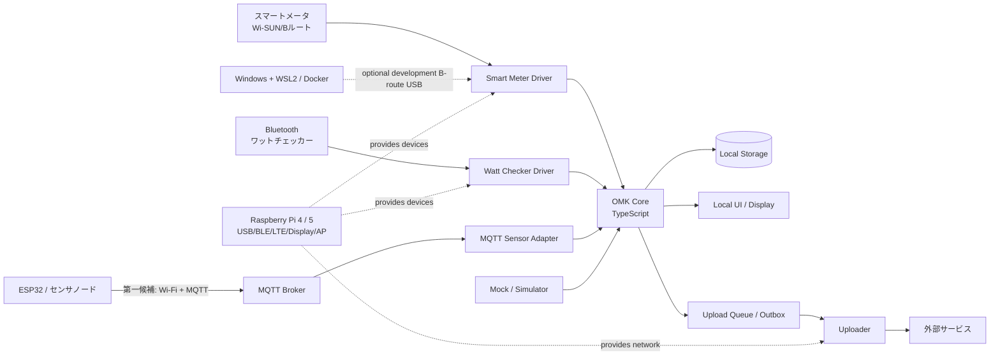

# OMK — おうちモニタキット

OMK（おうちモニタキット）は、住宅内の電力消費と環境・行動に関係するデータを、必要なセンサを組み合わせて継続的に計測・可視化・送信するためのIoTセンサ基盤です。

このリポジトリでは、既存のOMKを単にコンテナ化するだけでなく、次の状態へ再設計することを目的とします。

- Raspberry Pi 4およびRaspberry Pi 5の両方で安定して長期間運用できる
- 正式対象OSを64-bit Raspberry Pi OSへ限定し、32-bit版を対象外とする
- Windows上でモックを使って開発・テストでき、開発中に必要な場合だけBルートUSBドングルを使ってスマートメータ実機を検証できる
- センサ、通信機器、クラウド送信先を交換しやすい
- 既存のNode.js処理とPython処理を段階的に整理できる
- 人間と生成AIのどちらにも構造と判断理由が分かる
- 一部の機器や製品が廃止されても、システム全体を書き直さずに済む

> **現在の位置付け**<br>
> 本文書は再開発時の設計基準です。既存実装と本文書が食い違う場合は、既存実装を無条件に正とせず、差分を確認して設計判断を記録してください。

## 0. 新しいRaspberry Piへの導入

Raspberry Piを新規購入してOMK用ホストを作る場合は、まず
[Raspberry Pi初期セットアップ](docs/raspberry-pi-setup.md)を使用します。購入から
Docker動作確認までの手順と、Raspberry Pi Imagerで入力する項目を一箇所にまとめています。

準備するものは、64-bit Raspberry Pi OSを実行できるRaspberry Pi 4または5、対応する
電源、OSを書き込むmicroSDカード、ネットワーク接続（有線LANまたは設定可能なWi-Fi）、
Windows PCです。初期設定はSSHで行えるため、キーボードとディスプレイは必須ではありません。

導入の順序は次のとおりです。

1. Raspberry Pi ImagerでOS、`omkdev`ユーザー、SSH、ネットワーク、地域設定を準備する
2. Raspberry Piを起動し、WindowsからSSH接続する
3. `/home/omkdev/projects/omk`へこのリポジトリをcloneする
4. `./scripts/setup-raspberry-pi.sh`を実行し、再ログイン後にDockerを確認する
5. Onyx を使う場合は [SORACOM Onyx セットアップ](docs/soracom-onyx-setup.md)を実行する
6. 後続タスクとして、周辺機器、秘密情報、OMKサービス、表示・ネットワーク機能を個別に設定する

現時点のセットアップスクリプトは、OS更新、Docker、データ保存領域までを準備します。
OMKアプリケーションやDocker Composeサービスは起動しません。実機用Compose構成、秘密情報、
周辺機器設定が整備されるまでは、本番計測の開始手順として扱わないでください。

## 1. OMKが扱う範囲

OMKは、次の処理を一つの製品・開発基盤として扱います。

1. センサや計測機器からデータを取得する
2. ベンダー固有の形式をOMK共通データ形式へ変換する
3. データを一時保存し、欠損や通信断に耐える
4. 本体ディスプレイやWeb UIで現在値・履歴を表示する
5. SORACOM等の通信回線を通じて外部へ送信する
6. 機器状態、通信状態、異常を監視できるようにする

既存または移行対象として、少なくとも次を想定します。

- スマートメータBルート通信
- Bluetooth対応ワットチェッカー
- 室温・湿度・CO2濃度・ドア開閉等のセンサ
- Raspberry Pi公式7インチディスプレイ
- SORACOM Onyx等のLTE USBドングル
- ESP32を利用した遠隔センサノード

## データ収集と一次保存

OMKのデータは、原則としてMQTTでRaspberry Piへ集約し、汎用`sensor-collector`がJSON Lines（JSONL）で一次保存します。collectorは`omk/#`を購読し、センサ機種や測定項目を解釈せずに、受信時刻・トピック・MQTTメタデータとpayloadを保存します。保存先は`data/sensors/YYYY/MM/DD.jsonl`です。測定値とstatusメッセージの両方が対象です。

JSONL保存に成功した計測値のうち、Bルート`power`、SEN66`sen66`、一条`power-flow`は、表示用の最新状態JSON（`data/latest/broute_power.json`、`sen66.json`、`ichijo_power_flow.json`）もatomic置換で更新します。dashboardは瞬時値をlatest JSONから読み、`/api/display`を10秒ごとに取得して画面を更新します。今日の買電量・売電量と履歴用途は、JSONLから変換したParquetを使用します。

```text
各データ取得処理 → MQTT → sensor-collector → JSONL一次保存 → Parquet（日計・履歴）
                                      ↓
                          latest JSON（瞬時値）→ dashboard
```

ESP32などのセンサ系サービスとMosquitto、collectorはDocker Composeで運用します。一方、USBシリアル、OS権限、PANA認証に強く依存するBルート通信は、当面ホスト上のsystemdサービスで実行します。Bルート値のMQTT publishとcollectorによるJSONL保存は実装済みです。既存の専用保存の扱いは、並行運用の検証結果に基づいて判断します。

起動とログ確認は次のとおりです。

```bash
docker compose up -d --build sensor-collector
docker compose logs --tail=100 sensor-collector
```

各JSONL行は独立したJSONです。一次保存は汎用JSONLとし、CSVなどの用途別形式は後段の処理で生成します。

分析用には、独立した`services/data-transformer`でJSONLを`data/processed/`配下の日時・データセット別Parquetへ変換できます。Bルートの瞬時電力・積算電力量・30分値とSEN66を正規化します。`status`は管理情報として意図的に除外し、未知のトピックや不正レコードだけを`data/errors/transform/`へ追跡情報付きで記録します。実行方法とスキーマは[サービスREADME](services/data-transformer/README.md)を参照してください。

## 2. 採用する設計方針

### 2.1 モジュラーモノリスを基本とする

業務ロジックは一つのコードベース内で明確なモジュールに分けます。最初から多数のマイクロサービスへ分割しません。

一方、次のように実行環境や責務が明確に異なるものは、Docker Compose上で別コンテナにできます。

- TypeScriptによるOMKコア
- Web UI
- MQTTブローカー（ESP32連携の第一候補であるWi-Fi＋MQTT方式に使用）
- 移行期間中のPythonアップローダ
- 開発用センサシミュレータ

つまり、**コード構造はモジュラーモノリス、配備は少数の責務別コンテナ**を基本とします。

### 2.2 ハードウェア固有処理を隔離する

スマートメータ、Bluetooth機器、USBシリアル、ESP32等へのアクセスは、ドメインロジックから直接行いません。各機器は共通インターフェースを実装する「ドライバ／アダプタ」として扱います。

機器固有コードを交換しても、計測、保存、表示、送信のロジックが影響を受けない構造にします。

### 2.3 Raspberry Pi OSとDockerの責務を分ける

次は原則としてホストOS側の責務です。

- LTEドングルの認識・接続設定
- BluetoothデーモンとD-Bus
- USB・シリアルデバイスの認識と権限
- udevによる安定したデバイス名
- ディスプレイの向き、解像度、キオスク起動
- 時刻同期、OS更新、再起動、電源管理

次は原則としてコンテナ側の責務です。

- 計測プロトコルの実装
- データ正規化
- 保存、可視化、送信
- 再送、エラー処理、ログ、ヘルスチェック
- モック／シミュレータによる開発

コンテナへ安易に`privileged: true`を与えず、必要なデバイス、ソケット、権限だけを明示します。

### 2.4 Windowsではモックを基本とし、Bルート実機接続は任意とする

Windowsは主に開発・デバッグ・自動テスト用です。通常の開発とCIでは、USB、Bluetooth、Wi-SUN、LTE等を、同じインターフェースを実装するモックまたはシミュレータへ差し替えます。実機がなくても全体を起動できることを開発要件とします。

Bルート対応USBドングルをWindowsへ接続し、WSL2またはDockerコンテナから利用する経路は、利用できる開発者向けの任意検証経路とします。目的は、開発中にスマートメータ実機との接続、認証、計測、切断、再接続を確認することに限定します。通常の開発、CI、本番運用の必須要件には含めません。正式な対応判定と長時間試験は、Raspberry Pi 4とRaspberry Pi 5の両方で行います。Windows固有の差異はアダプタ、デバイスパス、Compose差分へ隔離します。

### 2.5 MQTTは機器境界の第一候補とする

ESP32等の外部ノード、疎結合にする必要がある計測プロセス、状態通知では、OMK用Wi-Fi＋MQTTを第一候補として設計・試作します。BLEは代替候補として比較しますが、初期実装はWi-Fi＋MQTTを優先します。

同一プロセス内のモジュール間通信まで何でもMQTTにせず、プロセス内では型付きの関数・ポートを優先します。

## 3. 全体像



## 4. 想定リポジトリ構成

```text
.
├── README.md
├── compose.yaml
├── broute-meter/              # Bルート計測の独立サブプロジェクト
│   ├── src/
│   ├── tests/
│   ├── config/
│   ├── Dockerfile
│   ├── pyproject.toml
│   └── README.md
├── docs/
├── data/                      # Git管理外: data/broute-meter/ など
├── logs/                      # Git管理外: logs/broute-meter/ など
└── services/gateway/           # 既存コンポーネント（この変更では移動しない）
```

計測・収集プログラムは、原則として機能単位の独立フォルダをOMKルート直下へ追加します。
現時点では`apps/`、`services/`、`sensors/`などの新たな中間階層を設けません。
実行時の計測データとログは、各サブプロジェクト内へ保存せず、OMKルートの
`data/<機能名>/`と`logs/<機能名>/`へ保存します。保存先は設定または環境変数で
切り替え可能にし、Dockerでは同じホスト領域をコンテナへマウントします。

既存の`services/gateway/`はこの方針策定前からあるため、現時点では不要な移動を
行いません。変更が必要になった時点で、責務と移行手順を明確にして扱います。

## 5. 開発環境

### Windows・モック環境

目的は、ドメインロジック、UI、保存、送信制御、エラー処理をハードウェアなしで開発することです。

```bash
cp .env.example .env
docker compose -f compose.yaml -f compose.mock.yaml up --build
```

モック構成では、センサシミュレータが共通データ形式またはMQTTメッセージを生成します。

### Windows・Bルート実機検証（任意）

Bルート対応USBドングルをWindowsからWSL2へ公開し、実機向けアダプタを有効にします。この経路は、開発中にスマートメータ実機との接続や計測を確認する必要がある開発者だけが使用します。USB転送方法、デバイスパス、権限はWindows／WSL2側の構成へ隔離します。

```bash
cp .env.example .env
docker compose -f compose.yaml -f compose.windows-hardware.yaml up --build
```

この構成でも、Bルート以外の機器はモックへ差し替え可能にします。Windowsでの実機検証は本番対応の判定には使用せず、同じ契約テスト、再接続試験、連続試験をRaspberry Pi 4とRaspberry Pi 5の両方で実施します。

### Raspberry Pi 4／5の実機

Raspberry Pi 4とRaspberry Pi 5の両方を正式対応機とします。正式対象OSは64-bit Raspberry Pi OSのみとし、32-bit Raspberry Pi OSは対象外です。周辺機器を認識・設定した後、実機向けCompose差分を使います。Raspberry Pi 3以前と、未評価の将来モデルは新OMKの正式な実行対象に含めません。

```bash
cp .env.example .env
docker compose -f compose.yaml -f compose.pi.yaml up -d --build
```

実機構成では、必要な`/dev`デバイス、D-Busソケット、設定ファイルだけを対象コンテナへ渡します。

> 上記ファイルがまだ存在しない段階では、これらを「実装すべき標準インターフェース」として扱ってください。

## 6. 設定と秘密情報

次の情報をGitへコミットしてはいけません。

- BルートID・パスワード
- SORACOMや外部サービスの認証情報
- MQTTの本番パスワード・証明書
- 住宅、利用者、設置場所を特定できる情報
- SIMや機器に紐づく秘密値

`.env.example`にはキー名と説明だけを置き、実値は`.env`、Docker secrets、または運用環境の秘密管理へ置きます。

## 7. 文書

- [計画・方針・システム設計の概要](docs/project-overview.md) — 再開発の背景、目的、全体方針、進め方
- [アーキテクチャ](docs/architecture.md) — モジュール境界、通信、データフロー、依存規則
- [設計原則](docs/design-principles.md) — 長期保守、交換可能性、AIフレンドリーな実装規約
- [ハードウェア](docs/hardware.md) — Raspberry Pi、Windows、ESP32、周辺機器の責務分担
- [開発ガイド](docs/development.md) — 開発手順、テスト、センサ追加、Codex利用時の規則
- [Raspberry Pi初期セットアップ](docs/raspberry-pi-setup.md) — Raspberry Pi Imager設定後のホスト環境構築
- [SORACOM Onyx セットアップ](docs/soracom-onyx-setup.md) — Onyx LTE モデムの認識・接続・診断
- [MQTT仕様](docs/mqtt.md) — ESP32センサノードとゲートウェイ間のトピックとpayload
- [ロードマップ](docs/roadmap.md) — 移行手順、完了条件、未決定事項

## 8. 実装時の必須ルール

- ベンダーSDKやデバイスAPIをドメイン層から直接呼ばない
- 計測値は共通の`Measurement`へ正規化してから後段へ渡す
- 時刻は内部ではUTCを使い、表示時だけローカル時刻へ変換する
- 値には単位を必ず持たせる
- 一つのセンサ故障で全計測を停止させない
- 外部送信は再送可能かつ重複に耐える設計にする
- 実機なしで動くモックを各ドライバに用意し、BルートのWindows実機検証は任意経路、正式な実機検証はRaspberry Pi 4と5の両方で行う
- 仕様変更にはテストと文書更新を含める
- 不明な設計事項を推測で固定せず、`docs/roadmap.md`の未決定事項へ追加する

## 9. 文書内のステータス表記

各文書では、設計判断を次のラベルで区別します。

- **採用**: 現時点で実装の基準とする
- **暫定**: 初期実装では使うが、検証後に見直す可能性がある
- **未決定**: 実装前または実装中に判断が必要
- **移行対象**: 既存実装を維持しつつ段階的に置き換える
