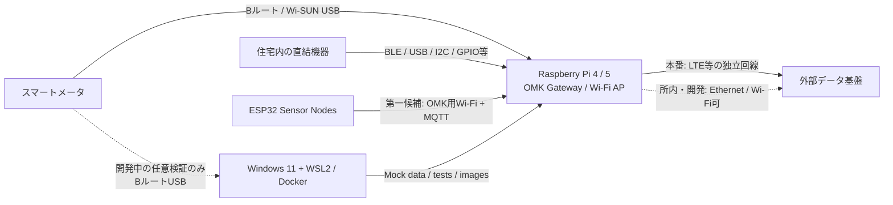
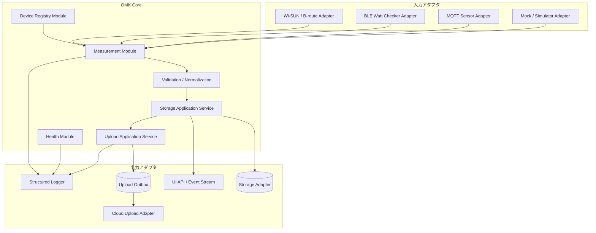

# アーキテクチャ

## 1. 目的

本書は、OMKの再開発におけるシステム境界、モジュール構成、データフロー、通信方式、依存規則を定義します。

OMKは周辺機器の種類が多く、Raspberry Pi OS、USB、Bluetooth、Wi-SUN、LTE、ディスプレイ、クラウド接続などの影響を受けます。そのため、ハードウェアやベンダー製品の変更がアプリケーション全体へ波及しない構造を最優先します。

## 2. アーキテクチャ判断の要約

| 項目 | 状態 | 方針 |
|---|---|---|
| コード構造 | 採用 | TypeScriptを中心としたモジュラーモノリス |
| 配備単位 | 採用 | Docker Composeで管理する少数の責務別コンテナ |
| 既存Python処理 | 移行対象 | 当面は独立コンテナ／アダプタとして維持し、必要性を見て統合 |
| ハードウェア連携 | 採用 | Ports and Adapters方式でドライバを交換可能にする |
| ESP32連携 | 暫定 | OMK用Wi-Fi＋MQTTを第一候補として設計・試作し、BLEは代替候補として比較 |
| 内部通信 | 採用 | 同一プロセス内は型付き呼び出し、機器・プロセス境界はMQTT等 |
| Windows開発 | 採用 | モックを標準とし、BルートUSB接続は開発中のスマートメータ実機確認に限る任意経路 |
| Raspberry Pi | 採用 | Raspberry Pi 4とRaspberry Pi 5の両方を正式対応。Raspberry Pi 3以前と未評価の将来モデルは正式対象外 |
| Raspberry Pi OS | 採用 | 64-bit Raspberry Pi OSのみを正式対象とし、32-bit版は対象外 |
| 本番ネットワーク | 採用 | 住宅Wi-Fiを動作要件とせず、OMK用APと独立した外部回線を基本とする |
| ローカル保存方式 | 未決定 | ポートを先に定義し、SQLite等の実装は別途決定 |
| UI技術 | 未決定 | ローカルWeb UIを前提とするが、フレームワークは未決定 |
| クラウド送信仕様 | 未決定 | 既存SORACOM送信処理を棚卸し後に契約を確定 |

## 3. システムコンテキスト



### 3.1 Raspberry Piの役割

Raspberry Pi 4とRaspberry Pi 5は、いずれも新OMKの正式対応ゲートウェイです。両モデルを64-bit Raspberry Pi OSで検証し、リリース判定では両方の必須実機試験を通過させます。Raspberry Pi 3以前と未評価の将来モデルは正式対応に含めません。

- 実機周辺機器への接続
- OMK用Wi-Fiアクセスポイントの提供
- ESP32等からのMQTT受信（第一候補のWi-Fi＋MQTT）
- 計測データの正規化
- ローカル保存
- ディスプレイ／Web UIへの提供
- 外部送信のキュー管理と再送
- ヘルスチェックとログ出力

### 3.2 ESP32の役割

ESP32はセンサの近くへ配置する軽量ノードです。

- センサ値を取得する
- 最小限の検証・変換を行う
- 第一候補としてOMK用Wi-Fi経由でMQTTへ送信する
- 初期実装はWi-Fi＋MQTTを優先する
- BLEを採用または併用する場合も、後段へ同じ計測契約を渡す
- 自身の稼働状態を通知する
- 一時的な通信断に対して、可能な範囲で再送またはローカル保持する

ESP32側へ、表示、長期保存、クラウド固有ロジック、複雑な業務判断を持ち込まないことを原則とします。

### 3.3 Windows開発PCの役割

Windowsは、実機に依存しない部分を高速に開発する標準環境です。Bルート対応USBドングルを使う経路は、利用できる開発者が開発中にスマートメータ実機を確認するための任意検証環境としてだけ扱います。

- センサシミュレータ
- モックドライバ
- 単体・統合テスト
- UI開発
- データ変換・送信制御の検証
- Dockerイメージのビルド
- 必要な場合のみ、BルートUSBドングルによるスマートメータ実機の接続、認証、計測、切断、再接続を開発検証

通常の開発とCIはモックで完結させます。WindowsでのBルート実機接続はCIや本番運用の要件に含めません。Windows固有のUSB転送やデバイスパスはアダプタとCompose差分へ隔離し、Bルートの正式な運用確認と長時間試験はRaspberry Pi 4とRaspberry Pi 5の両方で実施します。

## 4. 論理アーキテクチャ



## 5. モジュール境界

### 5.1 Devicesモジュール

責務:

- OMKが認識するデバイス、センサ、設置情報の管理
- ドライバ種別と設定の関連付け
- 有効／無効状態の管理
- 最終通信時刻、ファームウェア情報等の状態保持

持ってはいけない責務:

- ベンダーSDKの直接呼び出し
- 計測値の永続化
- クラウド送信

### 5.2 Measurementsモジュール

責務:

- ドライバから受け取った値の共通形式への正規化
- 型、単位、時刻、品質情報の検証
- 計測イベントの発行
- 異常値を破棄するか、品質フラグ付きで保持するかの判断

持ってはいけない責務:

- USBデバイスの探索
- MQTT接続設定
- 特定データベースのSQL
- 特定クラウドAPIの呼び出し

### 5.3 Storageモジュール

責務:

- 計測値の保存・取得ポートの提供
- 保持期間、集約、削除処理の調整
- 保存失敗時の扱い

保存技術は未決定です。ドメイン／アプリケーション層からは`MeasurementRepository`等のポートだけを参照します。

### 5.4 Uploadモジュール

責務:

- 送信対象の選別
- Outboxへの登録
- バッチ化
- 再送とバックオフ
- 送信済み状態の管理
- 重複送信に耐える識別子の付与

クラウド固有の認証やHTTP形式は出力アダプタへ隔離します。

### 5.5 Healthモジュール

責務:

- ドライバごとの稼働状態
- 最終計測時刻
- 保存／送信キューの滞留
- ネットワーク状態
- プロセスのヘルス／レディネス
- UIおよび運用ログへの状態提供

## 6. 層と依存規則

```text
Domain
  ↑
Application
  ↑
Ports
  ↑
Adapters / Infrastructure
  ↑
Bootstrap
```

依存の向きは内側へ向けます。

### 6.1 Domain

- 計測値、デバイス、品質、単位等の中核概念
- 外部ライブラリへの依存を最小化する
- Docker、MQTT、Bluetooth、DBを知らない

### 6.2 Application

- ユースケースと処理順序
- DomainとPortを組み合わせる
- 具体的なドライバやDB実装を知らない

### 6.3 Ports

外部依存に対するインターフェースです。

例:

```ts
export interface SensorDriver {
  readonly driverType: string;
  start(context: DriverContext): Promise<void>;
  stop(): Promise<void>;
  health(): Promise<DriverHealth>;
}

export interface MeasurementSink {
  publish(measurement: Measurement): Promise<void>;
}

export interface MeasurementRepository {
  append(measurements: readonly Measurement[]): Promise<void>;
  query(query: MeasurementQuery): Promise<readonly Measurement[]>;
}

export interface UploadTarget {
  send(batch: UploadBatch): Promise<UploadResult>;
}
```

### 6.4 Adapters

- Wi-SUN/Bルート
- Bluetoothワットチェッカー
- MQTT
- モック／シミュレータ
- ローカルDB
- SORACOMまたは外部API
- UI用HTTP/WebSocket

### 6.5 Bootstrap

- 設定ファイルと環境変数の読み込み
- 依存性注入
- ドライバ選択
- プロセス起動・停止
- シグナル処理

ビジネスロジックを`bootstrap`へ書きません。

## 7. 共通計測データ形式

各ドライバは、ベンダー固有値を次の共通形式へ変換してから後段へ渡します。

```ts
export type MeasurementQuality =
  | "ok"
  | "estimated"
  | "out-of-range"
  | "device-error";

export interface Measurement {
  readonly schemaVersion: 1;
  readonly id: string;
  readonly siteId: string;
  readonly deviceId: string;
  readonly sensorId: string;
  readonly metric: string;
  readonly value: number | boolean | string;
  readonly unit: string | null;
  readonly observedAt: string;
  readonly receivedAt: string;
  readonly quality: MeasurementQuality;
  readonly sequence?: number;
  readonly attributes?: Readonly<Record<string, string | number | boolean>>;
}
```

### 7.1 必須規則

- `observedAt`と`receivedAt`はISO 8601のUTC表現にする
- 物理量には単位を付ける
- `deviceId`と`sensorId`は表示名ではなく安定した識別子にする
- 同一データを再送しても識別できる`id`を持たせる
- ドライバ固有情報は`attributes`へ無制限に押し込まず、共通化すべき項目はスキーマへ昇格する
- スキーマ変更時は`schemaVersion`と契約テストを更新する

### 7.2 保留中のメタデータ配置

設置場所、アダプタ版、校正情報については、各`Measurement`へ直接保存するか、Device Registryと設置・校正履歴から参照するかを現時点では決定しません。スキーマ確定までは、これらを必須フィールドとして実装しないでください。

### 7.3 metricの初期例

| metric | value | unitの例 |
|---|---:|---|
| `electric.power.active` | number | `W` |
| `electric.energy.imported` | number | `Wh` |
| `environment.temperature` | number | `Cel` |
| `environment.humidity` | number | `%` |
| `environment.co2` | number | `ppm` |
| `contact.open` | boolean | `null` |

命名を増やす際は、同じ物理量を機器名ごとに別metricへしないでください。

## 8. MQTT境界

MQTTは、ESP32との通信における第一候補であり、独立プロセスとの境界にも利用できます。初期設計・試作はOMK用Wi-Fi＋MQTTを優先し、BLEは代替または併用候補として比較します。

### 8.1 初期トピック規約

```text
omk/v1/{siteId}/devices/{deviceId}/measurements
omk/v1/{siteId}/devices/{deviceId}/status
omk/v1/{siteId}/devices/{deviceId}/commands/{commandName}
omk/v1/{siteId}/devices/{deviceId}/command-results/{requestId}
```

### 8.2 MQTTメッセージ規則

- payloadはJSONとし、JSON Schemaを`packages/contracts`へ置く
- 計測値にはスキーマバージョン、時刻、デバイス識別子を含める
- statusはretained messageを利用できる
- commandには`requestId`と期限を持たせる
- broker切断中の動作を定義する
- 本番環境では匿名接続を許可しない
- MQTTを同一プロセス内の関数呼び出し代替として使わない

QoS、retain、再送上限は実機試験で確定します。

## 9. データフロー

### 9.1 通常計測

1. ドライバが値を取得する
2. ドライバが共通`Measurement`へ変換する
3. Measurementsモジュールがスキーマ、時刻、単位、品質を検証する
4. Storageモジュールがローカル保存する
5. UIへ現在値・更新通知を公開する
6. UploadモジュールがOutboxへ登録する
7. ネットワーク利用可能時に外部へ送信する
8. 成功時にOutboxを送信済みにする

「保存前に送信する」流れを標準にしません。通信断でデータを失わないため、原則はローカル保存を先に行います。

### 9.2 通信断

- 計測とローカル保存を継続する
- 送信失敗はOutboxへ残す
- 指数バックオフと上限付きジッタで再送する
- キュー上限に近づいた場合は警告を出す
- 容量不足時の削除方針を運用設定として明示する

### 9.3 センサ故障

- 対象ドライバだけを異常状態にする
- 他センサの計測を継続する
- 再初期化を一定間隔で試す
- 連続失敗回数と最終成功時刻を公開する
- プロセス全体を再起動するのは最終手段とする

## 10. コンテナ構成

### 10.1 候補構成

| サービス | 主な責務 | 言語／実装 |
|---|---|---|
| `core` | ドライバ統合、正規化、保存、送信制御、API | TypeScript |
| `ui` | 本体表示・Web表示 | 未決定 |
| `mqtt` | ESP32連携の第一候補であるWi-Fi＋MQTTのメッセージ中継 | MQTT broker |
| `uploader-python` | 既存Python送信処理の移行 | Python |
| `simulator` | Windows・CI向け疑似計測 | TypeScript等 |

`core`を細かく多数のサービスへ分割しません。別コンテナ化は、次のいずれかを満たす場合だけ検討します。

- 実行言語・ランタイムが異なる
- ハードウェア権限を分離する必要がある
- 独立して再起動・更新する運用上の価値がある
- 障害分離が明確に必要である

### 10.2 Composeファイル

- `compose.yaml`: 共通サービスとネットワーク
- `compose.mock.yaml`: シミュレータ、実機ドライバ無効化
- `compose.windows-hardware.yaml`: Windows／WSL2上の任意Bルート実機検証用アダプタとデバイス設定
- `compose.pi.yaml`: Raspberry Pi 4／5向けの`/dev`、D-Bus、実機設定の追加

環境ごとにDockerfileやコードを分岐させず、設定とアダプタ選択で切り替えます。

## 11. APIとUI

UIはローカルネットワークまたは本体ディスプレイから利用するWeb UIを基本とします。

最低限必要なAPI:

- 現在値
- 期間指定の履歴
- デバイス一覧と状態
- 送信キューの状態
- システムヘルス
- バージョン情報

UIはドライバ固有APIへ直接アクセスしません。`core`が公開する安定したAPIだけを利用します。

## 12. 設定

設定の優先順位は次を基準とします。

1. コマンドライン引数（診断用途に限定）
2. 環境変数・Docker secrets
3. 設置単位の設定ファイル
4. リポジトリ内の安全な既定値

設定例:

```yaml
siteId: omk-lab-001

drivers:
  - id: main-meter
    type: wisun-b-route
    enabled: true
    devicePath: /dev/omk-wisun

  - id: room-watt-checker
    type: ble-watt-checker
    enabled: true
    address: ${WATT_CHECKER_ADDRESS}

upload:
  enabled: true
  target: soracom
  batchSize: 100
```

秘密情報は設定ファイルへ直接記述せず、環境変数またはsecret参照にします。

## 13. 可観測性

### 13.1 ログ

- JSON構造化ログを標準とする
- `timestamp`、`level`、`service`、`module`、`event`を含める
- `deviceId`、`sensorId`、`requestId`、`measurementId`を必要に応じて含める
- 認証情報、Bルート資格情報、個人情報を出力しない
- 同じエラーを高頻度に無制限出力しない

### 13.2 ヘルスチェック

- liveness: プロセスが応答するか
- readiness: 必須依存が利用可能か
- component health: 各ドライバ、DB、MQTT、アップローダの状態

Dockerのhealthcheckと、UIで確認できる診断APIを用意します。

## 14. セキュリティ境界

- コンテナは非root実行を基本とする
- `privileged: true`を標準にしない
- 実機デバイスは必要なコンテナにだけ渡す
- MQTTは認証・ACLを設定する
- UI/APIの公開範囲をローカルに限定できるようにする
- 外部通信は送信先を明示的に許可する
- 秘密値はログ、例外、診断出力に含めない
- リモート更新機能を導入する場合は署名検証とロールバックを設計する

## 15. 変更時の判断基準

次の変更は、実装と同時に本書またはADRへ記録します。

- 新しいトップレベルモジュールの追加
- コンテナの追加・分割・統合
- 共通`Measurement`スキーマの変更
- MQTTトピック・payloadの変更
- 保存方式の決定
- クラウド送信契約の変更
- 実機権限の追加
- Raspberry Pi 4／5の対応条件や64-bit Raspberry Pi OSの変更

