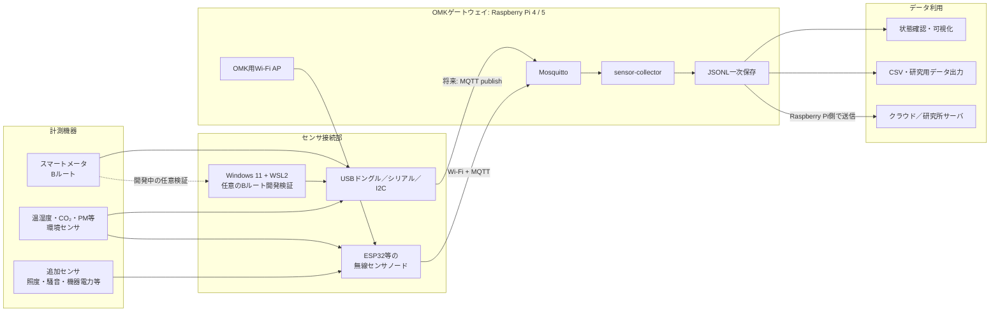
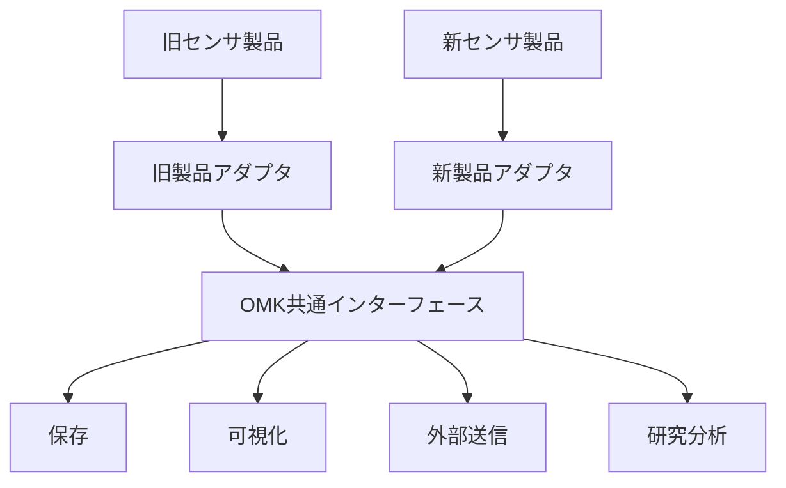

# おうちモニタキット（OMK）再開発

## 計画・方針・システム設計の概要

本書は、OMK再開発の背景、目的、基本方針、全体構成、開発の進め方を共有するための概要文書です。

詳細仕様の正本は、次の文書とします。

- 共通データ形式、モジュール境界、依存方向、MQTT案: [`architecture.md`](architecture.md)
- ハードウェア、ネットワーク、実行環境: [`hardware.md`](hardware.md)
- 実装、テスト、開発手順: [`development.md`](development.md)
- 段階移行と未決定事項: [`roadmap.md`](roadmap.md)

本書と詳細文書が食い違う場合は、どちらかを黙って優先せず、設計判断を確認して両方を更新します。

> **確定した実行環境の前提**
> - Raspberry Pi 4とRaspberry Pi 5の両方を正式対応機とする
> - 正式対象OSは64-bit Raspberry Pi OSのみとし、32-bit版は対象外とする
> - WindowsでのBルート実機接続は、開発中のスマートメータ実機検証だけを目的とする任意経路とする
> - ESP32とゲートウェイ間は、OMK用Wi-Fi＋MQTTを第一候補とする

---

## 1. 背景

おうちモニタキット（OMK）は、住宅内の電力消費量、温湿度、空気質などを簡易に計測し、住宅・エネルギー分野の研究に活用するための計測システムです。

現行システムは開発から約10年が経過しており、次の問題が顕在化しています。

- 委託開発されたソフトウェアの内部構造や仕様が分かりにくい
- OS、Node.js、Python、ライブラリ等の更新に追従できていない
- センサ、通信機器、ゲートウェイ端末の廃盤が発生している
- 特定製品や特定ベンダーへの依存が強い
- 機能追加や不具合修正に多くの調査・作業を要する
- 研究目的ごとにセンサや処理を変更しにくい

今回の再開発では、現行機能を単純に再現するのではなく、今後の製品変更、研究ニーズの変化、ソフトウェア更新を前提とした構造へ再設計します。

---

## 2. 再開発の目的

OMK再開発の主な目的は、次のとおりです。

1. **住宅への設置・運用を容易にする**
2. **センサや通信機器の変更を吸収できるようにする**
3. **研究目的に応じて計測項目を追加できるようにする**
4. **ソフトウェアを継続的に更新できるようにする**
5. **特定の担当者やベンダーに依存しない開発体制を構築する**
6. **生成AIを利用した開発・保守を行いやすくする**

---

## 3. 基本方針

### 3.1 製品ではなく「役割」に依存する

特定のセンサやゲートウェイ製品をシステムの前提とせず、各機器が担う役割を明確にします。

例えば、温湿度、CO₂、粒子状物質を計測するセンサが廃盤になった場合でも、同じ種類のデータを出力できる別製品へ交換できる構造とします。

システム内部では、製品固有の通信方式やデータ形式を直接扱わず、デバイスアダプタでOMK共通形式へ変換してから、保存、表示、外部送信、研究用出力へ渡します。

---

### 3.2 住宅側のWi-Fiに依存しない

OMKはさまざまな住宅への設置を想定しているため、本番設置では原則として設置先住宅のWi-FiまたはLANを動作要件にしません。

住宅側ネットワークへ依存すると、次の問題が生じます。

- 居住者によるSSID・パスワード登録が必要になる
- ルータ交換時に再設定が必要になる
- IPアドレスやネットワーク構成が住宅ごとに異なる
- セキュリティポリシーや通信制限の影響を受ける
- 現地対応の負担が大きくなる

このため、Raspberry Pi 4またはRaspberry Pi 5のゲートウェイをOMK用Wi-Fiアクセスポイントとして動作させ、Wi-Fiを使用するセンサノードはOMK自身のネットワークへ接続する構成を基本とします。

外部へのデータ送信は、LTE等、住宅ネットワークとは独立した通信手段を基本とします。所内試験、開発、保守では、Ethernetまたは既存Wi-Fiを利用しても構いません。本番用ネットワークと開発用ネットワークの違いは設定として明示します。

---

### 3.3 機能を小さな単位へ分離する

計測、通信、保存、送信、表示などの機能を分離し、ある機能の変更がシステム全体へ波及しない構造とします。

ただし、初期段階から多数のマイクロサービスへ細分化するのではなく、一つのコードベースとして管理しながら内部を明確なモジュールに分割する「モジュラーモノリス」を基本とします。

必要性が明確になった機能については、後から独立したコンテナまたはサービスへ分離できる構造とします。

---

### 3.4 Dockerを実行環境の基本とする

ソフトウェアはDockerコンテナ上で動作させ、OSやライブラリの違いによる影響を小さくします。

Dockerの採用によって、すべての保守問題が解消されるわけではありません。センサドライバ、ホストOS、カーネル、ライブラリ等の更新は引き続き必要です。

一方で、次の効果が期待できます。

- 開発環境と実機環境の差を小さくできる
- 使用するライブラリのバージョンを明確にできる
- 古い環境を再現しやすい
- 更新対象と影響範囲を限定できる
- 問題発生時に以前のイメージへ戻しやすい
- Windows、Raspberry Pi 4、Raspberry Pi 5で共通の開発手順を利用できる

USB認識、Wi-Fiアクセスポイント、LTE接続、Bluetoothデーモン、時刻同期等は、原則としてホストOS側の責務とします。計測プロトコル、正規化、保存、表示、再送等はコンテナ側の責務とします。

---

### 3.5 Windowsではモックを基本とし、Bルート実機接続は任意とする

Windows 11、WSL2、Dockerを日常開発の中心環境とします。通常の開発とCIは、実機を必要としないモック、シミュレータ、記録済みデータで完結させます。

Bルート対応USBドングルをWindowsへ接続し、WSL2またはDockerコンテナから利用する経路は、利用できる開発者向けの任意検証経路です。目的は、開発中にスマートメータ実機との接続、認証、計測、切断、再接続を確認することに限定します。通常の開発、CI、本番運用の要件には含めません。

正式な動作確認、長時間試験、再起動試験、電源断試験は、Raspberry Pi 4とRaspberry Pi 5の両方で実施します。

---

## 4. 想定する全体構成

### 現在のデータ収集方針

データ取得処理と保存処理を分離する。各取得処理は原則としてMQTTでRaspberry Piへデータを集約し、汎用`sensor-collector`が`omk/#`を購読して日次JSONLへ一次保存する。collectorはセンサ固有項目を解釈しないため、未知のセンサ、device ID、測定項目の追加にcollector変更なしで対応できる。

CSVは分析・受け渡し用の派生形式であり、DB化、可視化、外部送信もJSONL保存より後段の責務とする。センサノードはクラウドへ直接接続せず、外部通信はRaspberry Pi側へ集約する。



Bルート通信はUSBシリアル、OS権限、認証、PANA通信への依存が強いため、当面ホスト上のsystemdサービスで実行し、コンテナ化しない。将来、Bルート取得値をMQTTへpublishしてcollectorで保存する。移行時は既存の専用保存とMQTT→JSONL保存を二重化して検証し、安定後に既存保存の廃止可否を判断する。

---

## 5. ソフトウェア設計

### 5.1 デバイスアダプタ

センサや通信機器ごとの差異は、デバイスアダプタで吸収します。

アダプタは製品固有の通信処理を行い、取得した値をOMK共通データ形式へ変換します。

```text
SEN66固有データ
    ↓
SEN66アダプタ
    ↓
OMK共通形式
温度、湿度、CO₂、PM2.5、VOC、計測時刻、機器ID、品質情報
```

センサを交換する場合は、新しいアダプタを追加または交換し、データ収集以降の処理は原則として変更しません。

Windowsの任意検証経路とRaspberry Pi 4／5の正式運用で利用するBルートアダプタについても、OS固有分岐をドメインロジックへ広げず、シリアル入出力境界と設定へ隔離します。

---

### 5.2 共通データ形式

各センサのデータは、少なくとも次の情報を追跡できる共通形式へ変換します。

- スキーマバージョン
- 計測データID
- 設置サイトID
- 機器ID
- センサID
- 計測対象
- 計測値
- 単位
- 実際の計測時刻
- ゲートウェイが受信した時刻
- 品質・エラー情報
- 必要に応じた設置場所、アダプタ版、ファームウェア版等のメタデータ

概念例:

```json
{
  "schemaVersion": 1,
  "id": "01K0EXAMPLE000000000000000",
  "siteId": "omk-house-001",
  "deviceId": "living-sen66-01",
  "sensorId": "co2",
  "metric": "environment.co2",
  "value": 650,
  "unit": "ppm",
  "observedAt": "2026-07-23T03:00:00.000Z",
  "receivedAt": "2026-07-23T03:00:00.120Z",
  "quality": "ok"
}
```

内部時刻はUTCで扱い、画面表示または研究用出力の段階で必要なローカル時刻へ変換します。

共通形式の正式な型、必須項目、metric、unit、qualityの規則は[`architecture.md`](architecture.md)を正とします。設置場所、アダプタ版、校正情報を各`Measurement`へ直接含めるか、機器台帳や設置・校正履歴から参照するかは現時点では保留とします。上の概念例には、判断済みの必須項目だけを示しています。

---

### 5.3 モジュール構成

OMKコア内部では、次の論理モジュールへ分割します。

```text
Devices          # 機器、センサ、設置、設定、状態
Measurements     # 収集、正規化、検証、品質判定
Storage          # 保存、取得、保持期間、容量管理
Upload           # Outbox、外部送信、再送、重複制御
Export           # CSV等の研究用データ出力
API              # 管理・参照用API
Health           # 機器・サービス・通信状態
Ports            # 外部依存に対するインターフェース
Adapters         # Bルート、BLE、MQTT、DB、外部API等
Bootstrap        # 設定読込、依存性注入、起動・停止
```

実際の物理ディレクトリはトップレベルの[`README.md`](../README.md)を正とし、`apps/core/src/`以下へ上記の責務を配置します。

モジュール間の呼び出し方向を明確にし、センサ固有処理がシステム全体へ広がらないようにします。

---

### 5.4 コンテナ構成

初期構成では、次の実行単位を候補とします。

- `core`: データ収集、正規化、保存制御、API、送信制御
- `ui`: ローカル表示、Web表示
- `mqtt`: ESP32連携の第一候補であるWi-Fi＋MQTTの中継
- `simulator`: Windows、CI向けの疑似計測
- `uploader-python`: 既存Python送信処理の移行用

ローカルDBは、採用技術によって次のいずれかとします。

- SQLite等の組み込みDBを`core`から利用し、永続volumeへ保存する
- 独立DBサービスを別コンテナとして動かす

コンテナ数を増やすこと自体を目的としません。実行言語、更新周期、障害範囲、必要権限、依存ライブラリが異なる場合に分離します。

---

### 5.5 保存と外部送信

外部送信は、計測直後にネットワークへ直接送るだけの構造にしません。

```text
MQTT publish
  ↓
sensor-collectorによるJSONL一次保存
  ↓
CSV変換・分析・可視化・外部送信
```

通信断中も取得処理と一次保存を継続する。外部送信のキュー、再送、重複制御はJSONL保存後に設計・実装する。

---

## 6. 生成AIを利用しやすい設計

今後は、人間だけでなく生成AIによるコード理解、修正、テスト作成、ライブラリ更新への対応を想定します。

そのため、次を設計上の原則とします。

- 一つのファイルや関数を過度に長くしない
- モジュールの責務を一つに絞る
- 入出力とインターフェースを明示する
- 暗黙的な状態や複雑な副作用を避ける
- 設定値をソースコードへ直接記述しない
- 各モジュールに自動テストを用意する
- READMEと設計文書を常に更新する
- 重要な設計判断をADRとして記録する
- サンプルデータと機器を使わないテスト手段を用意する
- エラーメッセージとログを機械的に追跡できる形式にする
- Windows、Raspberry Pi、モックの差を設定とアダプタ境界へ閉じ込める

生成AIが扱いやすい構造は、人間にとっても理解・保守しやすい構造となります。

---

## 7. 開発環境

### 7.1 基本環境

- 開発PC: Windows 11
- Linux環境: WSL2
- エディタ: Visual Studio Code
- 実行環境: Docker／Docker Compose
- バージョン管理: Git
- リモートリポジトリ: GitHub
- 新OMK実機: Raspberry Pi 4およびRaspberry Pi 5（両方を正式対応）

Raspberry Pi 3以前は新OMKの正式な実行対象に含めません。現行OMKの調査、データ比較、移行確認に限って利用します。将来モデルは、実機試験を完了するまで正式対応に含めません。

---

### 7.2 Windows上での初期開発

初期開発は、Raspberry Pi上だけで行うのではなく、Windows上のWSL2およびDocker環境を中心に進めます。

Windows上で次を先行して開発・確認します。

- 共通データモデル
- Bルート通信処理
- センサアダプタ
- データ保存
- API
- CSV出力
- Outboxと外部送信制御
- ログ・エラー処理
- 自動テスト
- Docker構成

Bルート通信は、次の三つの経路で検証します。

1. 記録済みフレーム、fixture、モックを使用する自動テスト
2. 必要な開発者だけが行う、Windows＋WSL2／Docker＋USBドングルによるスマートメータ実機検証
3. Raspberry Pi 4およびRaspberry Pi 5で行う正式な実機検証

GPIO、I²C、Bluetooth、アクセスポイント、LTE、ディスプレイ等のRaspberry Pi固有機能は、Raspberry Pi 4とRaspberry Pi 5の両方で確認します。

---

### 7.3 CPUアーキテクチャへの対応

開発PCは主にAMD64、新OMKのRaspberry Pi 4およびRaspberry Pi 5は64-bit Raspberry Pi OS上のARM64を正式対象とします。

Dockerイメージは、可能な限りAMD64とARM64の両方で動作するマルチアーキテクチャ構成とします。

ハードウェアへ直接アクセスする処理はアダプタ層へ限定し、その他の処理は両環境で共通化します。32-bit Raspberry Pi OSは正式対象外です。採用する64-bit Raspberry Pi OSのリリース、最小メモリ、ストレージ構成は実機構成確定時に記録します。

---

## 8. 想定するハードウェア構成

| 区分 | 候補 | 役割 |
|---|---|---|
| ゲートウェイ | Raspberry Pi 4／5 | データ収集、保存、通信、OMK用AP、表示 |
| 環境センサ | SEN66等 | 温湿度、CO₂、粒子状物質、VOC等 |
| センサノード | ESP32 | センサ接続、第一候補のWi-Fi＋MQTT、代替候補のBLE |
| 電力計測 | Bルート対応USBドングル | スマートメータからの電力データ取得 |
| Windows開発機 | Windows 11＋WSL2 | モック開発、必要時のみスマートメータBルート実機検証 |
| 外部通信 | LTE／USBモデム等 | 住宅Wi-Fiを使わない外部送信 |
| ストレージ | microSDまたは外部SSD | ローカルデータ保存 |
| 電源・筐体 | 市販品または専用構成 | 長期安定運用 |

SEN66等をRaspberry Piへ直接接続する構成だけでなく、ESP32をセンサノードとして利用し、ゲートウェイとセンサを離して設置できる構成も検討します。

ESP32とゲートウェイの通信は、OMK用Wi-Fi＋MQTTを第一候補とし、BLE方式と比較します。用途によって併用する可能性も残しますが、後段へ渡す共通計測契約は統一します。

---

## 9. 製品廃止を吸収する仕組み

製品廃止への対応は、代替品をその都度探すだけではなく、システム構造として吸収します。



主な対策は次のとおりです。

- 製品固有処理をアダプタへ隔離する
- 共通データ形式を定義する
- センサの識別情報と校正情報を管理する
- 実機がなくても動作確認できるモックを用意する
- 過去データを使った回帰テストを実施する
- 複数製品を同時にサポートできる構造とする
- 製品選定条件と代替候補を文書化する
- ソフトウェア、アダプタ、ファームウェア、設定ファイルのバージョンを記録する
- BルートアダプタはWindowsの任意検証経路とRaspberry Pi 4／5で同じ契約を共有する

---

## 10. 開発の進め方

### フェーズ1: 要件・基本設計

- 現行OMKの機能整理
- 今後必要な計測項目の整理
- 必須機能と研究ごとの追加機能の分離
- 共通データ形式の策定
- モジュール構成の決定
- 通信・ネットワーク方式の検討
- WindowsとRaspberry Piの実機検証範囲の整理

### フェーズ2: Windows上での基盤開発

- GitHubリポジトリの整備
- Docker開発環境の構築
- 共通データモデルの実装
- Bルート通信のfixture／モック試作
- 必要な開発者向けに、Windows＋WSL2＋USBドングルによるBルート実機試作
- センサアダプタの試作
- データ保存、API、ログ機能の実装
- Outbox、CSV出力、外部送信境界の実装
- 自動テスト環境の構築

### フェーズ3: Raspberry Pi 4／5の実機対応

- 64-bit Raspberry Pi OS／ARM64環境での動作確認
- Raspberry Pi 4とRaspberry Pi 5の両方でBルートUSBドングルを正式実機試験
- USB、I²C、Bluetooth等の接続確認
- Wi-Fiアクセスポイント機能の構築
- LTE等の外部回線との共存確認
- 自動起動・異常復旧機能の実装
- 電源断や通信断を想定した試験
- 長期間連続運転試験

### フェーズ4: 試験設置

- 所内または協力住宅での試験
- 設置作業手順の確認
- 欠測、通信断、センサ異常の評価
- ログと遠隔状態確認方法の評価
- データ品質の確認
- 住宅ネットワークへ依存しないことの確認

### フェーズ5: 運用・更新体制の整備

- 更新手順の標準化
- バージョン管理ルールの策定
- 対応機器一覧の管理
- 障害時の切り戻し手順の整備
- バックアップと復元手順の整備
- 設計文書と運用マニュアルの継続更新

---

## 11. 当面の検討事項

Raspberry Pi 4とRaspberry Pi 5の正式対応、64-bit Raspberry Pi OSのみの正式採用、Windows Bルート実機接続の任意化、ESP32通信の第一候補をWi-Fi＋MQTTとする点は決定済みです。

現時点で、特に次を整理する必要があります。

1. 正式採用する64-bit Raspberry Pi OSのリリース、最小メモリ、ストレージ構成
2. 環境センサをゲートウェイへ直接接続するか、ESP32経由とするか
3. ESP32通信をWi-Fi＋MQTTへ確定する条件と、BLEを採用または併用する例外条件
4. Wi-Fiアクセスポイント機能とLTE等の外部通信をどのように共存させるか
5. WindowsからWSL2／DockerへBルートUSBドングルを公開する任意検証手順
6. 正式対応するBルートUSBドングルの型番とプロトコル差
7. ローカルに保存するデータ量と保存期間
8. クラウドまたは研究所サーバへの送信方式
9. 遠隔更新と障害復旧の方法
10. 対応するセンサの必須範囲
11. セキュリティ、認証、暗号化の詳細方針
12. 長期運用に適したストレージと電源構成
13. 既存OMKとのデータ互換性
14. 研究利用向けAPIおよびデータ出力仕様
15. **保留:** 設置場所、アダプタ版、校正情報を各`Measurement`へ直接保存するか、機器台帳や設置・校正履歴から参照するか

---

## 12. まとめ

OMK再開発では、特定製品の置き換えではなく、製品変更やソフトウェア更新を前提とした持続可能な計測基盤を構築します。

中心となる考え方は、次のとおりです。

- 製品固有処理をアダプタへ隔離する
- センサデータを共通形式へ変換する
- システムを責務ごとのモジュールへ分割する
- Dockerによって開発・実行環境を標準化する
- Windows上でモックを中心に基盤を開発する
- BルートUSBドングルのWindows実機検証は、開発中に必要な場合だけ利用する
- 正式な運用確認はRaspberry Pi 4とRaspberry Pi 5の両方で行う
- 住宅側Wi-Fiへ依存しない
- ローカル保存とOutboxによって通信断に耐える
- テスト、文書、ログを含めて保守可能な状態を維持する
- 人間と生成AIの双方が理解しやすい構造とする

これにより、センサ、通信機器、ゲートウェイ製品が変更された場合でも、影響範囲を限定しながらOMKを継続的に更新できる構造を目指します。
