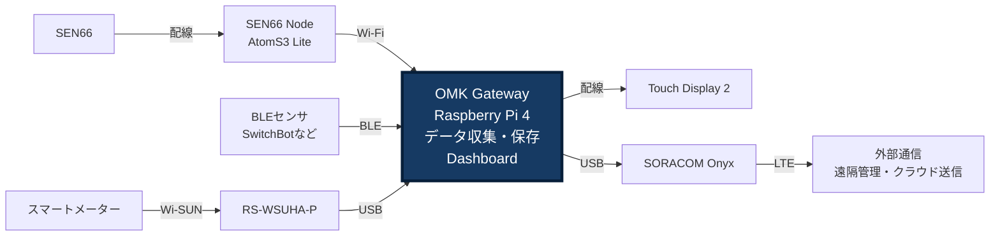

# 1-1. OMK導入ガイド

おうちモニタキット（OMK）は、住宅の電力・環境・行動を計測するシステムです。データを収集・保存するOMK Gateway、計測するセンサ・機器、現在の値と機器の状態を表示するDashboardで構成します。

推奨するGateway構成は、Raspberry Pi 4、Touch Display 2（7インチ）、SORACOM Onyxです。Gatewayのセットアップ後に、空気質センサのSEN66とAtomS3 Liteを組み合わせた「SEN66 Node」を1台製作し、計測を始めます。

分からない用語がある場合は[「用語集」](glossary.md)を参照してください。

## 導入の順序

| 章 | 行うこと | 章の終了時に確認すること |
| --- | --- | --- |
| 2. OMK Gatewayを製作・セットアップする | 部品を用意し、Gatewayを組み立て、OSとOMKを設定する | Dashboard、保存機能、OMK AP、Gateway側のBLE・Bルートサービスが準備でき、Gatewayのセットアップが完了している |
| 3. SEN66 Nodeを製作・セットアップする | SEN66 Nodeを組み立て、設定・登録し、設置する | 実際の計測値がGatewayへ届き、Dashboardの値と最終更新が更新される |
| 4. Dashboardを使う | Touch Display 2で表示設定、機器の状態確認、データ書き出しの方法を確認する | 日常の計測確認とデータの取り出しができる |

各ページ末尾の「次へ」に沿って進めてください。まず対応機器と計測項目を確認し、部品の準備、Gatewayの製作、SEN66 Nodeの製作、Dashboardの操作へと進みます。

## OMKのハードウェア構成とデータの流れ

- Gatewayがセンサからデータを集めて保存し、Touch Display 2にDashboardを表示します。
- SEN66 Nodeは、配線したSEN66の計測値をWi-FiでGatewayへ送ります。Gatewayと通信できる位置へ設置します。
- BLEセンサはGatewayで直接受信できます。
- Bルートを使う場合は、RS-WSUHA-Pがスマートメーターと通信します。
- OnyxはGateway自身の外部通信に使います。SORACOM Harvestへの送信や遠隔管理には、利用するサービス側の設定も必要です。

## OMK内部をつなぐネットワーク

図のNodeとGatewayのWi-Fi通信には、Gatewayが用意するOMK APを使います。APはAccess Point（アクセスポイント）の略です。OMK APは、Gateway・Node・管理端末を結ぶOMK専用のローカルネットワークです。

初回セットアップでは、パッケージを取得するために既存Wi-Fiでインターネットへ接続します。OMK APへ切り替えると、Raspberry Piの内蔵Wi-FiはAP専用になり、既存Wi-Fiには接続しなくなります。その後、Gateway自身の外部通信はOnyxが担います。

OMK APへ接続した端末のインターネット通信は、Gateway経由では転送しません。管理端末の通信によって意図せずSORACOMの通信量・料金が増えることを防ぎます。構築後のローカル計測・保存・表示は、住宅側ネットワークに依存せず利用できます。

次へ：[「1-2. 対応センサ・機器と取得データ」](supported-devices.md)
