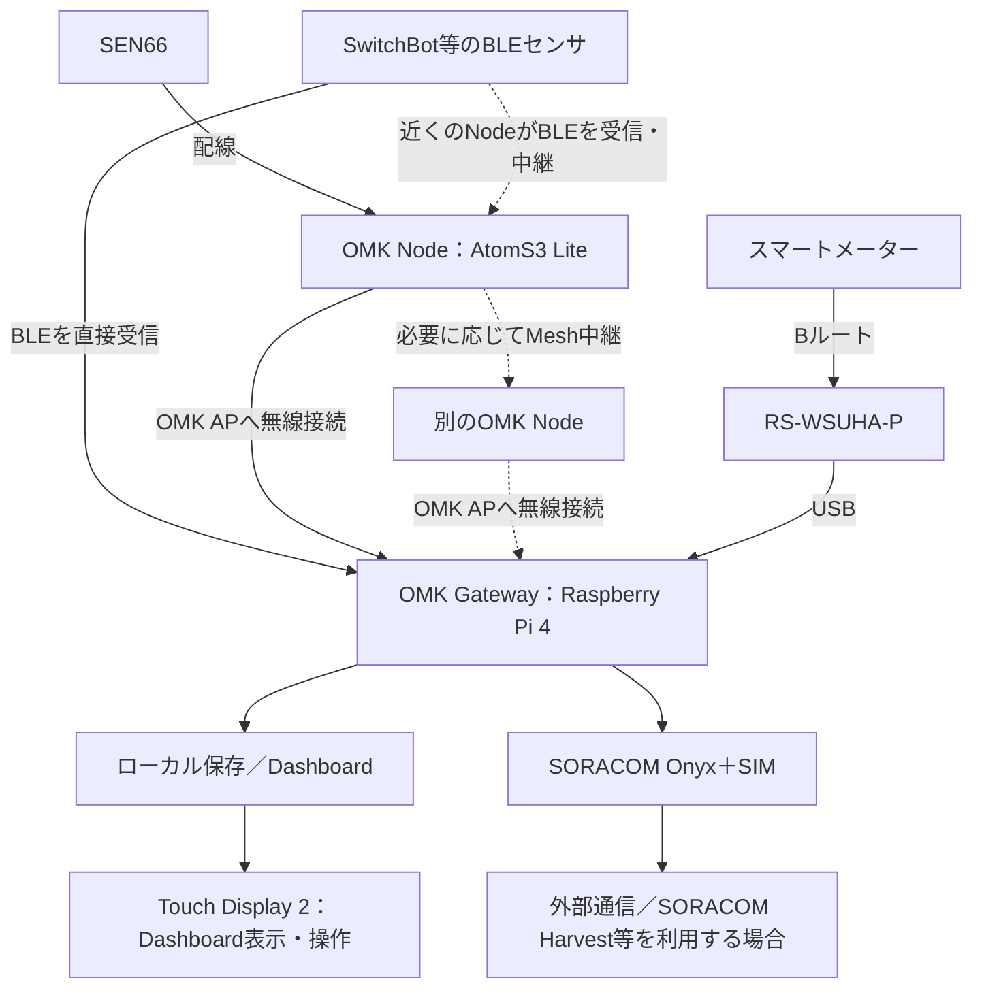

# OMK製作ガイド

初めてOMKを製作する方は、このページから順に進めてください。**まずOMK本体（Gateway）を完成させ、その後SEN66 Nodeを1台追加して、Dashboardで計測値を確認します。** 各ページの末尾に次の手順へのリンクがあります。

標準構成は、Raspberry Pi 4、Raspberry Pi Touch Display 2（7インチ）、SmartiPi Touch Pro 3ケース、SORACOM OnyxとSIM、OMK専用Wi-Fi（OMK AP）です。設定にはWindows PC、インターネットに接続できる既存Wi-Fi、USBキーボードを使います。

## 完成までの順序

| 順番 | ページ | この工程で行うこと |
| --- | --- | --- |
| 1 | [OMKの参考パーツ構成](parts-list.md) | GatewayとSEN66 Node 1台分の部品・工具をそろえる |
| 2 | [Gatewayの組み立て](gateway-assembly.md) | ケース、Touch Display 2、Raspberry Piを組み、SIMとOnyxを取り付ける |
| 3 | [Gatewayセットアップ](gateway-setup.md) | OSを書き込み、基本設定、Onyx、Dashboard・保存機能、OMK AP、BLE、Bルートサービスを順に設定する |
| 4 | 同ページの[OMK本体完成の確認](gateway-setup.md#9-セットアップ完了を確認する) | Dashboardを操作でき、Gateway側の標準機能が準備できたことを確認する |
| 5 | [センサ・計測機器を追加する](sensor-setup.md) | 最初のセンサとしてSEN66 Nodeの製作へ進む |
| 6 | [SEN66 Nodeの組み立て](sen66-node-assembly.md) | SEN66・接続基板・AtomS3 Liteを配線する |
| 7 | [AtomS3 LiteをOMK Nodeとしてセットアップする](esp32-node-setup.md) | GatewayへUSB接続して設定し、SEN66を登録して、設置先で計測を確認する |
| 8 | [Dashboardの使い方](dashboard.md) | 実測値と更新時刻を確認し、表示・日々の運用を始める |

Gatewayセットアップでは、現行スクリプトの順序に合わせてOMK APへ切り替えた後、Gateway本体のターミナルでBLEとBルートサービスを個別に導入します。途中で操作場所が変わる箇所も手順内に記載しています。

## OMK本体の完成とは

Touch Display 2でDashboardが使え、データの受信・保存、OMK AP、BLE Sensor Manager、Bルートサービスなど、Gateway側の標準機能がセットアップ済みになった状態です。

この時点ではセンサ未登録で構いません。Bルートも、アダプタと認証情報がなければサービスを導入・有効化した待機状態です。**個別BLEセンサの登録、BルートID・パスワードの入力、SEN66 Nodeや追加Nodeの製作・登録は、本体完成後に行います。**

## OMK全体のつながり

GatewayはBLEセンサを直接受信できます。離れたBLEセンサは、近くのOMK Nodeが代わりに受信してGatewayへ送れます。この「BLE中継」と、Node同士でデータの通信経路をつなぐ「Mesh中継」は別の機能です。詳細図は[OMK Nodeの役割と設置](node-and-sensors.md)にあります。

AtomS3 Liteは市販の小型端末です。OMK用ファームウェアと設定を導入した端末を**OMK Node**、SEN66を接続したOMK Nodeを**SEN66 Node**と呼びます。その他の用語は[用語集](glossary.md)を参照してください。

## OMK APとは

OMK APは、**Gateway・OMK Node・管理用PCなどをつなぐOMK専用のローカルネットワーク**です。

- 接続したPCはGateway内のDashboardを開けます。Nodeは計測データをGatewayへ送れます。
- PCやNodeがGatewayを経由してインターネットへ出る用途には使いません。AP側から外部への転送と上流DNS問い合わせは制限されています。
- 外部通信が必要なときはGateway自身がOnyxを使います。これにより、AP側端末のインターネット通信でSORACOM回線を意図せず消費することを防ぎます。
- AP有効化後、Raspberry Piの内蔵Wi-FiはOMK専用になり、初期設定に使った既存Wi-Fiからは切断されます。PCの「インターネットなし」という表示は正常です。

## ここから製作を始める

ここまでで、標準構成と本体完成・センサ追加の区切りを確認しました。

**次へ：[OMKの参考パーツ構成](parts-list.md)で部品をそろえます。**

製作中に止まったら[トラブルシューティング](troubleshooting.md)を参照してください。完成後の変更は[Gatewayの更新・保守](gateway-maintenance.md)、ディスプレイなし・Onyxなし・家庭内Wi-Fiなどは[標準構成以外・高度な構成](advanced-configuration.md)にまとめています。
