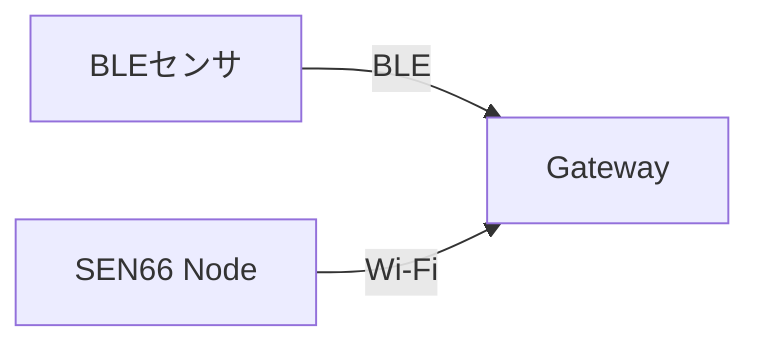

# OMK Nodeで計測範囲を拡張する

Gatewayから離れた部屋や別の階でも計測したいときに、OMK Nodeを追加する必要があるかを判断するページです。OMK Nodeは、AtomS3 LiteにOMK用ファームウェアと設定を導入した端末です。SEN66を接続して計測するほか、センサや別のNodeから届いたデータをGatewayへ送る役割も担えます。

## Gatewayへ直接届く場合は、そのまま使う

BLEセンサの電波がGatewayへ届き、計測値が更新されていれば、そのセンサのためにNodeを追加する必要はありません。SEN66 NodeもGatewayと通信できていれば、1台で計測を続けられます。

## BLEセンサの電波が届かない場合

Gatewayへ直接届かないBLEセンサの近くにNodeを置き、そのNodeがセンサの電波を受信してGatewayへデータを送れます。これが「BLE中継」です。Nodeは、対象のBLEセンサの電波が届き、Gatewayとも通信できる位置に置きます。

BLEセンサの初回登録はGatewayの近くで行います。Node経由でのみ受信している未登録センサは探索候補に表示されないためです。登録後に設置場所へ戻して中継を利用します。

## 離れたNodeの通信が届かない場合

SEN66 NodeなどがGatewayと直接通信できないときは、その間に別のNodeを置き、Node同士でデータを運べます。これが「Mesh中継」です。間に置くNodeには、離れたNodeとGatewayの両方へ通信できる位置を選びます。

BLE中継は「BLEセンサの電波をNodeが受ける機能」、Mesh中継は「Nodeからのデータを別のNode経由でGatewayへ運ぶ機能」で、別の機能です。同じNodeで両方を使えます。例えば、Nodeが受信したBLEデータを、さらに別のNode経由でGatewayへ届けることもできます。

図は通信経路の例です。実際のNode間通信にはESP-WIFI-MESHを使い、配置や電波の状態に応じて経路が選ばれます。すべてのNode同士が直接つながる必要はありません。

## SEN66 Nodeと中継専用Nodeを選ぶ

SEN66 Node自身も、SEN66を計測しながらBLE中継やMesh中継を行い、通信経路の一部になれます。既に設置したSEN66 Nodeで届くなら、専用のNodeを増やす必要はありません。

その場所でSEN66を計測する必要がなく、通信範囲を広げたい場合は、センサを接続しない「中継専用Node」を置きます。どちらのNodeも設置場所でUSB電源から常時給電するため、電源を確保できる場所を選びます。壁や階、金属によって電波の届き方が変わるので、設置後に通信を確認して位置を調整します。

中継専用Nodeが必要と判断したら、[「中継専用OMK Nodeをセットアップする」](relay-node-setup.md)で準備・設定・設置を行います。SEN66の計測も追加する場合は、[「3-1. SEN66 Nodeの組み立て」](sen66-node-assembly.md)を参照してください。
