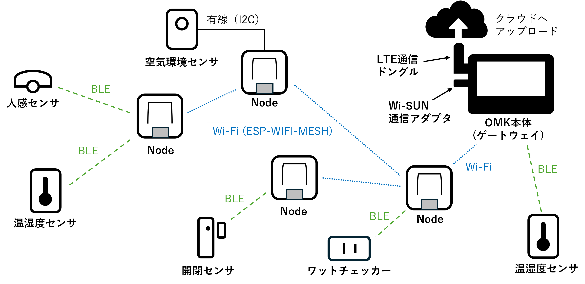

# 6-1. OMK Nodeで計測範囲を拡張する

SEN66 Nodeの初回計測まで完了した後、Gatewayから離れた場所へ計測範囲を広げる必要がある場合に読むページです。OMK Nodeは、AtomS3 LiteにOMK用ファームウェアと設定を導入した端末で、センサの接続に加えて通信の中継にも使えます。

SEN66 Nodeを配置して中継を兼ねる方法と、SEN66を接続しない「中継専用Node」を追加する方法があります。BLEセンサの電波を受ける役割と、Gatewayまでデータを運ぶ経路を分けて考え、必要な位置にNodeを置きます。

## SEN66を接続するNode

空気質センサのSEN66をOMK Nodeへ接続した構成を「SEN66 Node」と呼びます。温度・湿度・CO₂濃度などを計測し、Gatewayへデータを届けられる範囲なら、Gatewayから離れた部屋にも設置できます。

配線やケースの組み立ては[「3-2. SEN66 Nodeの組み立て」](sen66-node-assembly.md)を参照してください。

## BLEセンサを中継するNode

BLE中継は、Gatewayから離れたSwitchBot等のBLEセンサの電波を、近くのOMK Nodeが代わりに受信し、そのデータをGatewayへ送る機能です。BLEは、SwitchBotなどの無線センサとの通信に使う方式です。

SEN66 NodeがBLE中継を兼ねることも、SEN66を接続しない中継専用Nodeを使うこともできます。Gatewayが直接受信できるBLEセンサだけを使う場合は、Nodeは不要です。

初回登録は、対象のBLEセンサをGatewayの近くへ置いて[「4-1. Dashboardの使い方」](dashboard.md#bleセンサを探索して登録する)に従って登録します。Node経由でのみ受信している未登録センサは探索候補に表示されません。登録後に設置場所へ戻します。

## Node同士で通信を中継する

Node同士でESP-WIFI-MESHによる通信を中継し、Gatewayから離れた場所まで通信範囲を広げます。Gatewayと離れたNodeの間に、互いに通信できる範囲で別のNodeを置きます。これは、BLEセンサの電波を受けるBLE中継とは別の役割で、SEN66の計測データやNodeが受信したBLEデータをGatewayまで運ぶ経路になります。

OMKのNode間通信には、Espressifが提供する[ESP-WIFI-MESH](https://docs.espressif.com/projects/esp-idf/en/stable/esp32/api-guides/esp-wifi-mesh.html)を利用しています。ESP-WIFI-MESHはNodeが階層的につながるツリー状の構成で通信を中継する仕組みで、すべてのNode同士が常時直接通信する完全メッシュではありません。OMKでは、この仕組みを基盤として、通信が不安定になった場合の自動復旧などの機能を追加しています。

緑の線はBLEセンサからの受信、青い線はNode間のESP-WIFI-MESHによる通信と、GatewayへのWi-Fi接続を表します。Gatewayへ向かう中継経路が構成されます。

この図はNodeとMeshの詳細図です。Bルート、表示、保存、外部通信を含む関係は[「1-1. OMK導入ガイド」](getting-started.md#omkのハードウェア構成とデータの流れ)を参照してください。

## 設置場所を決める

- Nodeは、GatewayまたはGatewayへ中継できる別のNodeと通信できる位置に置きます。
- BLE中継に使うNodeは、対象センサの電波も届く位置に置きます。
- 壁や階を隔てる場所、金属で囲まれた場所では、通信が不安定になることがあります。設置後はDashboardの「機器管理」でNodeの「接続」が「オンライン」になり、中継するBLEセンサの「最終受信」が更新される位置を選びます。届かなければ、Gatewayや別のNode、センサに近づけます。
- Nodeは設置場所でUSB電源へ接続し、常時給電します。中継専用Nodeも電源を入れておきます。
- SEN66 Nodeは、SEN66の吸気・排気口を塞がないように置きます。

## 追加するNodeを準備する

SEN66を使わない場所へ中継用の端末を置く場合は、[「6-2. 中継専用OMK Nodeを追加する」](relay-node-setup.md)に部品と設定・設置確認をまとめています。SEN66も計測する場合は、[「3-2. SEN66 Nodeの組み立て」](sen66-node-assembly.md)と[「3-3. SEN66 Nodeをセットアップする」](esp32-node-setup.md)を参照してください。使用済みNodeの設定変更は[「5-2. OMK Nodeの更新・再設定」](node-maintenance.md)で扱います。
