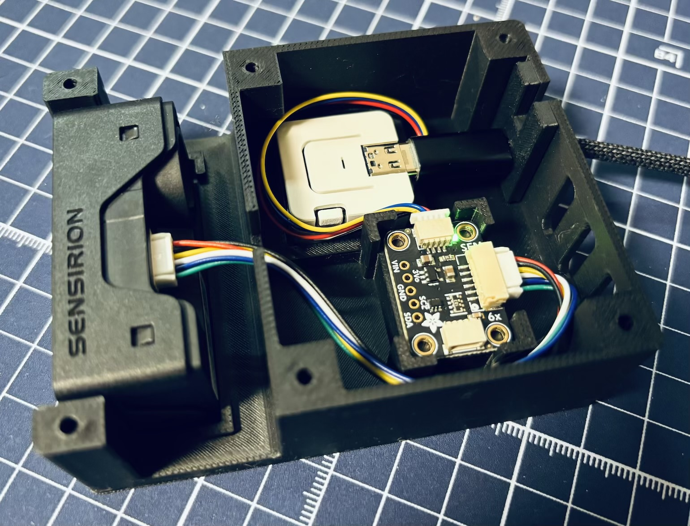

# SEN66 Nodeの組み立て

SEN66とAtomS3 Liteを接続し、3Dプリントした試作ケースへ収める手順です。このページでは配線までを行い、蓋を開けたまま次の初期設定・計測確認へ進みます。

## この手順の前に

[Gatewayセットアップ](gateway-setup.md)を完了し、Dashboardを使える状態にしておきます。以下の部品と3Dプリントしたケースをそろえ、**AtomS3 LiteのUSBをGatewayや電源へつながない状態**で組み立てを始めます。SEN66の配線が終わってから、次のページでGatewayへUSB接続します。

## 必要な部品と工具

実際に使用している参考構成です。別製品を選ぶ場合は、下のケーブル・固定具の条件に合わせてください。価格、在庫、納期は各販売元で確認できます。

| 部品・工具 | 使用・参考製品 | 用途・条件 |
| --- | --- | --- |
| 空気質センサ | [Sensirion SEN66](https://www.digikey.jp/ja/products/detail/sensirion-ag/SEN66-SIN-T/25700945) | 温湿度・空気質の計測用 |
| 接続基板 | [Adafruit SEN6x Breakout for Sensirion SEN66 - STEMMA QT / Qwiic](https://www.digikey.jp/ja/products/detail/adafruit-industries-llc/6331/26761418) | SEN66とAtomS3 Liteを接続 |
| Node用ハードウェア | [M5Stack AtomS3 Lite](https://www.switch-science.com/products/8778) | 次の工程でOMK Nodeとして設定し、センサのデータをGatewayへ送信 |
| SEN66用ケーブル | [JST GH 1.25MM PITCH 6 PIN CABLE 100mm（Adafruit 5754）](https://www.digikey.jp/ja/products/detail/adafruit-industries-llc/5754/21839797) | SEN66と接続基板の接続用 |
| Grove/Qwiic変換ケーブル | [4-PIN STEMMA/GROVE - QT/QWIIC 4"変換ケーブル 100mm](https://www.digikey.jp/ja/products/detail/adafruit-industries-llc/4528/11627737) | 接続基板とAtomS3 Liteの接続用 |
| ケース | 3Dプリントした本体、蓋、ケーブル固定具 | データは[STL](#stl)を参照 |
| ネジ | M3×8mmネジ6本 | 蓋の固定用 |
| 工具 | M3タップと加工用工具、ネジ頭に合うドライバー | ネジ穴の加工・蓋の固定用 |
| USB電源 | USB-A出力のUSB電源 | 設置後の常時給電用 |
| USB-C to USB-Aケーブル | [Anker Zolo USB-C & USB-A ケーブル](https://www.ankerjapan.com/products/a8052)など | Nodeの初期設定に使うため、データ通信・給電の両方に対応したもの |

### ケーブル・固定具の条件

- **SEN66用ケーブル**：Adafruit 5754は、両端のコネクタの表裏の向きが反転したケーブルです。別のJST-GH 1.25mm 6ピンケーブルを使う場合は、コネクタ形状だけでなく、両端の向きと配線がAdafruit 5754と同じ製品を選んでください。
- **ケーブル固定具**：USB-Cケーブルの抜けや引っ張りを抑える部品です。適合を確認しているのはAnker Zolo USB-C & USB-A ケーブルのみです。別製品ではUSB-Cプラグ周辺の形状が合わない場合があります。固定具に収まらないものは無理に押し込まず、適合するケーブルを使ってください。

## 組み立ての流れ

1. ケースの本体・蓋・ケーブル固定具に割れ、反り、穴の詰まりがないかを見ます。電子部品を入れる前に、ネジ穴へM3タップ加工をします。
2. 加工で出た樹脂の切りくずやゴミを取り除きます。
3. **USB給電を外した状態で**、SEN66と接続基板の6ピン端子を、SEN66用ケーブルでつなぎます。コネクタの突起と差し込み口の形を合わせ、無理に押し込まず奥まで差し込みます。
4. 接続基板のSTEMMA QT / Qwiic端子とAtomS3 LiteのGrove端子を、Grove/Qwiic変換ケーブルでつなぎます。
5. 写真と同じ配置で、SEN66、接続基板、AtomS3 Liteをケース本体へ収めます。SEN66のコネクタは接続基板側へ、基板のコネクタ面は上へ、AtomS3 LiteのUSB端子はケースのケーブル出口へ向けます。
6. USB-CケーブルのUSB-C側をAtomS3 Liteへ接続し、プラグの根元を支える位置に固定具を取り付けます。**反対側はまだGatewayや電源へ接続しません。** ケーブルを蓋や部品の間に挟まず、SEN66の吸気・排気口を塞がないように通します。
7. SEN66、接続基板、AtomS3 Liteの配線と配置を写真と照合します。蓋は固定せず、ネジ6本と一緒に保管しておきます。

蓋の固定は、次のページで初期設定・登録と計測値の確認を済ませてから行います。

## STL

[ケースのSTLデータ](../../hardware/enclosures/sen66-node/)から、次の3点を使用します。

- `sen66-node-body.stl`：本体
- `sen66-node-lid.stl`：蓋
- `sen66-node-cable-jig.stl`：ケーブル固定具

ここまででSEN66とAtomS3 Liteの配線・ケースへの収納が完了しました。**次へ：[AtomS3 LiteをOMK Nodeとしてセットアップする](esp32-node-setup.md)**でGatewayへUSB接続し、設定・登録・計測確認・蓋の固定を行います。
